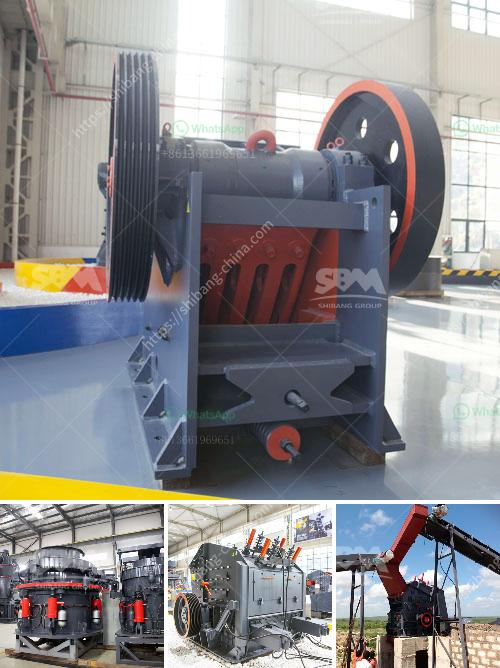

<h3>quarry equipment for sale in nigeria</h3>
Quarry equipment for sale in Nigeria has been widely recognized in the industry. Consequently, many quarry equipment suppliers in Nigeria are increasing their investment in the quarrying industry. Zenith is a professional manufacturer and supplier of quarry equipment in Nigeria. We provide comprehensive quarrying equipment for sale including extraction plant, crushing machine, grinding mill, screening machine, belt conveyor, washing plant etc.

The quarrying of granite, limestone, gravel, and other aggregate materials involves the use of heavy-duty equipment. Zenith quarrying equipment for sale combines high mobility with high productivity and great flexibility. They can be linked together variously to produce a range of fractions. With a high level of automation and excellent particle shape, the quarry equipment is suitable for a wide range of applications.

First, the raw materials are evenly sent to the jaw crusher by the vibrating feeder for primary crushing. Then the materials are transported by the belt conveyor to the cone crusher for secondary crushing. The cone crusher crushes the materials by compressing them between the moving cone and fixed cone. The final product is discharged from the discharge port at the bottom of the cone crusher.

After that, the crushed materials are sent to the vibrating screen for screening. The oversized materials are returned to the cone crusher for re-crushing, while the qualified materials are sent to the sand making machine for shaping. The sand making machine combines the unique rotor design with the effective crushing cavity, allowing it to produce high-quality aggregates with excellent particle shape.

In addition, for fine crushing, our quarry equipment also includes VSI crusher for tertiary and quaternary applications, providing the perfect particle shape for a wide range of applications. The VSI crusher, a vertical shaft impact crusher, reduces large rocks into smaller rocks or gravel, simulating the action of nature by eroding the raw materials to a desired size.

Furthermore, our quarry equipment for sale can be applied to a variety of rock, limestone, basalt, granite, pebbles, metallurgical slag, etc. Our quarry equipment can also be used to crush various stones and ores, such as marble, feldspar, calcite, lápice, gypsum, and gold ore and so on.

Finally, within the quarry production lines, crushers, grinders, vibrating feeders, conveyor belts, vibrating screens, and other equipment are essential in the production process. Zenith provides customers with integrated solutions from equipment selection to material testing, project design, installation, and commissioning.

In conclusion, quarry equipment for sale in Nigeria is gradually becoming more prominent and popular. Due to the significant improvement of infrastructure in Nigeria, more and more investors start to set up their own quarry plant. Zenith is a professional manufacturer and supplier of quarry equipment in Nigeria. We can provide high-quality and high-efficiency equipment for the Nigeria market. Choose Zenith, let us provide you with the most comprehensive quarry equipment for sale in Nigeria!
<h3>Contact us</h3><ul><li><strong>Whatsapp:&nbsp;<a href="https://wa.me/8613661969651">+8613661969651</a></strong></li><li><a href="https://swt.shibang-china.com/?git&amp;zhl&amp;quarry equipment for sale in nigeria"><strong>Online Service(chat now)</strong></a></li></ul><h3>Related</h3><ul><li><a href='sale of stone hammer hammer.md'>sale of stone hammer hammer</a></li><li><a href='laboratory jaw crusher.md'>laboratory jaw crusher</a></li><li><a href='ball mill for mineral grinding india.md'>ball mill for mineral grinding india</a></li><li><a href='used mobile jaw crusher dealers in ghana.md'>used mobile jaw crusher dealers in ghana</a></li><li><a href='dolomite processing plants from germany.md'>dolomite processing plants from germany</a></li></ul>