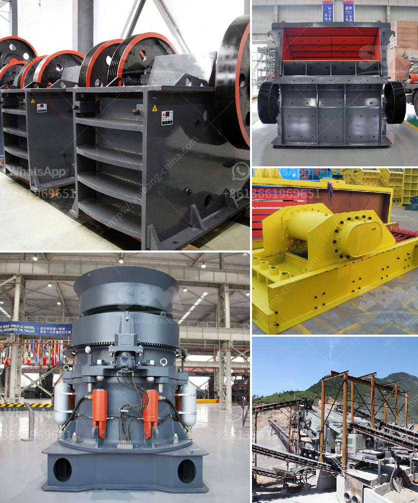

<h3>quarry machine in nigeria</h3>
Nigeria is blessed with abundant mineral resources, which are from time immemorial formed the backbone of the nation’s economic and industrial development aspirations. Prior to independence, the nation’s mineral raw material resources contributed immensely to the export earnings of the nation.

However, with the discovery of oil and gas in commercial quantity, the exploitation of solid minerals declined in the 1970s and 1980s. The mining of minerals in Nigeria accounts for only 0.3% of its GDP due to the influence of its vast oil resources. The domestic mining industry is underdeveloped, leading to Nigeria having to import minerals that could be produced locally.

Though there are quarrying companies that engage in large scale industrial quarrying, fueling a significant part of Nigeria’s economic activities, a variety of quarry machines are used in local mining industries. There are diverse types of quarry machines in Nigeria, each with its special applications and uses.

This type of quarry machinery is used to break, crush, and size different types of stones and rocks, such as granite, limestone, and other quarry stones. It is equipped with a crushing mechanism and powered by a diesel engine or electricity. Some of these machines are mobile, making it easier to move them from one quarry location to another.

Excavators or loaders are essential quarry machinery used to load haulages with stones, rocks, and other materials in a quarry site. They are versatile machines and can also be used for other construction purposes, such as digging trenches and foundations. They come in various sizes, weights, and bucket capacities depending on the scale of the quarry operation.

Quarry drilling machines are used to penetrate the ground to obtain samples of soil or rock. This is usually done for geotechnical investigations and exploration purposes, which aid in determining the suitability of a site for various uses, such as construction and mining. These machines are equipped with different types of drills, including diamond drills and rotary drills.

Crushers are essential quarry machine tools used to crush large stones into smaller sizes for construction purposes. These machines come in different specifications and configurations, depending on the nature of the material it will be used for. They are equipped with strong motors to enable efficient crushing of rocks and stones.

Screening machines are used to separate granules, stone, and similar materials of different sizes during quarry operations. They are typically used after the crushing process to organize and sort the materials according to their size. These machines are equipped with sieves or screens that allow only particles of specific sizes to pass through.

Quarry machines are essential equipment in the mining and construction industries, which can break, crush, load and screen stones for various uses. As a quarry owner, you could be working with many different types of stones and rocks in various sizes and quantities. However, the challenges of operating a quarry site differ from one to the other. This variation necessitates the need for diverse quarry machines suitable for different quarry operations.

As Nigeria strives to achieve self-sufficiency in minerals, quarrying machines play an important role in ensuring that the right machinery is used to obtain the necessary minerals and other raw materials needed for various industrial sectors. With the advancement of technology, quarry machines are designed to be more efficient, reducing operational costs for quarry operators. Ultimately, the effective and efficient use of quarry machines in Nigeria will determine how well the mining industry contributes to the nation's economic growth and development.
<h3>Contact us</h3><ul><li><strong>Whatsapp:&nbsp;<a href="https://wa.me/8613661969651">+8613661969651</a></strong></li><li><a href="https://swt.shibang-china.com/?git&amp;zhl&amp;quarry machine in nigeria"><strong>Online Service(chat now)</strong></a></li></ul><h3>Related</h3><ul><li><a href='hammer mills grinding.md'>hammer mills grinding</a></li><li><a href='granite crushers manufacturers.md'>granite crushers manufacturers</a></li><li><a href='mobile crushers gravels.md'>mobile crushers gravels</a></li><li><a href='stone crusher machine south africa.md'>stone crusher machine south africa</a></li><li><a href='used stone crushing plant for sale in germany.md'>used stone crushing plant for sale in germany</a></li></ul>