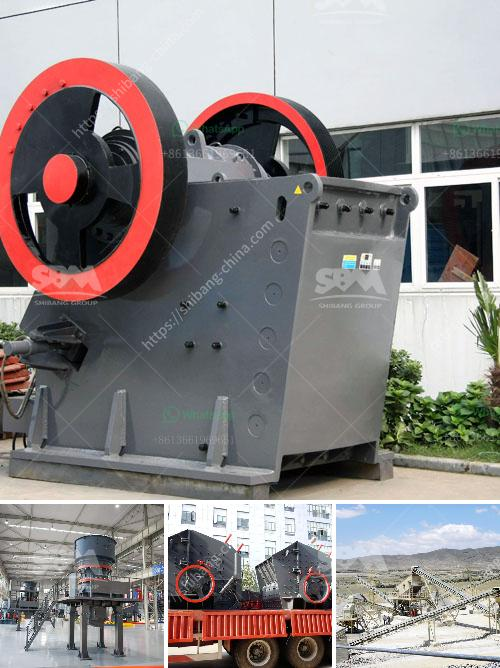

<h3>quarry machine manufacturers</h3>
The quarrying industry plays a pivotal role in the construction sector by providing essential raw materials used for various infrastructural development projects. Quarry machine manufacturers, also known as extraction equipment manufacturers, are at the forefront of this thriving industry. Given the significance of quarrying, it is crucial to delve deeper into the world of these manufacturers and the machines they produce.

Quarry machine manufacturers specialize in developing equipment essential for quarrying operations across various environments. Their machines are used to extract and process minerals, rocks, and other substances from the earth's surface. These materials are then utilized in construction projects, road building, and various other applications.

In recent years, the quarrying industry has experienced rapid growth. This growth is mainly attributed to increased demand for construction materials worldwide. As a result, manufacturers have had to innovate and provide efficient machinery capable of meeting this growing demand.

One of the critical roles played by quarry machine manufacturers is the design and production of drilling equipment. Quarry drills are crucial in quarrying operations as they are used for drilling holes to extract minerals and rocks. These drills must be powerful, versatile, and reliable to withstand the demanding environmental conditions commonly found in quarries.

Another essential equipment produced by quarry machine manufacturers is crushers. Crushers are used to break down large rocks and minerals into smaller, more manageable sizes. They come in various types, including jaw crushers, cone crushers, and impact crushers. These machines are designed to efficiently process different materials, enabling their use in various applications like road construction, building foundations, and railway ballasts.

Screening machines, another vital product from quarry machine manufacturers, are used to separate different sizes of materials obtained from quarries. These machines ensure that the extracted materials are divided into the required sizes for different applications. Vibrating screens and trommel screens are commonly used in quarries for efficient material separation.

Environmental factors and sustainability have gained significant attention in recent years. Quarry machine manufacturers have recognized the need to develop machinery that prioritizes sustainability without compromising on efficiency. Many manufacturers are now investing heavily in research and development to produce environmentally-friendly equipment. This includes machinery that emits lower levels of carbon emissions, reduces dependence on fossil fuels, and incorporates advanced recycling systems.

Furthermore, manufacturers are also implementing automation and digitalization in their machines. This advancement allows for more accurate and efficient operations while increasing safety. Remote monitoring systems and optimized machine controls have proven to be game-changers in ensuring maximum productivity and minimizing downtime.

The quarrying industry is highly competitive, and machine manufacturers are continually striving to stay ahead. Developing cutting-edge machinery requires significant investment in research, technology, and expertise. It is through these concerted efforts that quarry machine manufacturers have been able to transform the industry by producing reliable, efficient, and sustainable equipment.

In conclusion, quarry machine manufacturers play a critical role in the quarrying industry, providing essential machinery for the extraction and processing of materials needed for construction and infrastructure projects. The continuous innovation and advancement by these manufacturers ensure that the quarrying industry keeps up with the ever-growing demand for construction materials. As the industry continues to evolve, quarry machine manufacturers will undoubtedly play a pivotal role in shaping its future.
<h3>Contact us</h3><ul><li><strong>Whatsapp:&nbsp;<a href="https://wa.me/8613661969651">+8613661969651</a></strong></li><li><a href="https://swt.shibang-china.com/?git&amp;zhl&amp;quarry machine manufacturers"><strong>Online Service(chat now)</strong></a></li></ul><h3>Related</h3><ul><li><a href='netherlands impact crushers.md'>netherlands impact crushers</a></li><li><a href='sand washing plant in south africa.md'>sand washing plant in south africa</a></li><li><a href='plant and machinery of quartz for sale in india.md'>plant and machinery of quartz for sale in india</a></li><li><a href='detail project report on quartz powder plant.md'>detail project report on quartz powder plant</a></li><li><a href='indonesia ball mill manufacturer.md'>indonesia ball mill manufacturer</a></li></ul>