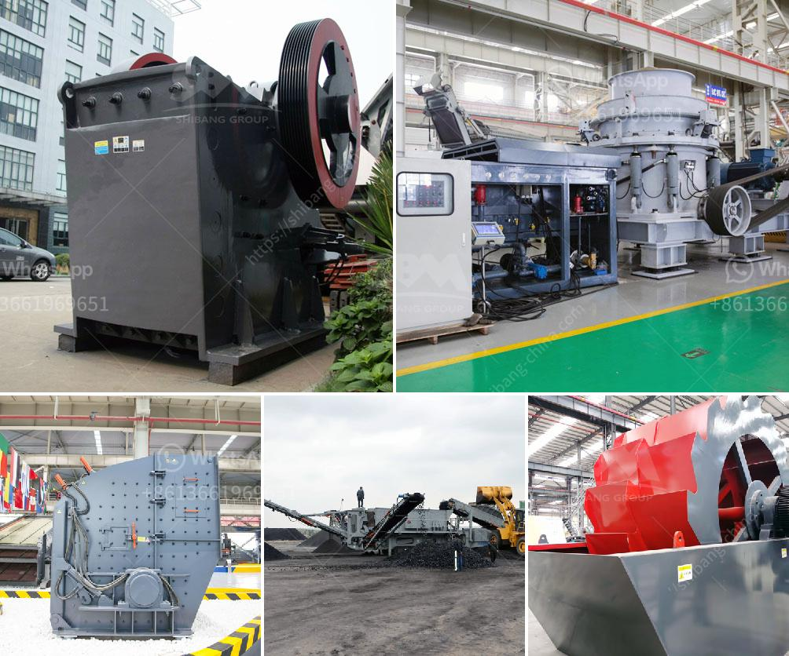

<h3>quarry machines manufacturer</h3>
The mining industry is constantly evolving and advancing, driven by the need for efficient extraction of valuable resources from the Earth. One crucial element in this process is the use of quarry machines, which are designed to extract and transport large blocks of stone, gravel, and other minerals from deep within the Earth's crust. In this article, we will explore the role of quarry machines manufacturers and how they bring innovation to the mining industry.

Quarry machines manufacturers play a vital role in the mining industry by providing efficient and innovative machinery that aids in the extraction and transportation of minerals. These machines are specially designed to withstand the harsh conditions of mining environments, such as extreme temperatures, dust, and vibrations, enabling them to operate effectively for extended periods.

One of the key aspects of quarry machines is their ability to extract materials efficiently and safely. Manufacturers employ advanced technologies such as computer-controlled systems and GPS tracking to enhance precision and reduce the risk of accidents. These machines are equipped with powerful engines that enable them to operate with less downtime, increasing productivity and reducing overall costs for mining companies.

In addition to their robustness and reliability, quarry machines manufacturers continuously strive to introduce innovations that improve the sustainability of mining operations. For instance, some manufacturers have developed machines that use alternative fuel sources like natural gas or electricity, reducing emissions and minimizing environmental impact. Others focus on the development of autonomous machines that can operate without human intervention, thereby improving safety and reducing the risk of accidents.

Furthermore, quarry machines manufacturers have embraced digitalization and the utilization of artificial intelligence (AI) to enhance the performance of their machines. AI-powered systems can analyze vast amounts of data in real-time, adjusting machine settings to maximize efficiency and optimize operations. This level of automation allows mining companies to make data-driven decisions, ensuring that equipment is working at its optimal level and minimizing downtime.

Another area where quarry machine manufacturers are making significant strides is equipment maintenance. By utilizing IoT (Internet of Things) technology, manufacturers can remotely monitor the performance of their machines, collecting data on critical factors such as engine temperature, oil levels, and component wear. This data is then analyzed to identify patterns and predict potential failures before they occur, enabling timely maintenance and reducing costly unplanned downtime.

In conclusion, quarry machines manufacturers are playing a pivotal role in the mining industry by providing innovative and efficient machinery that aids in the extraction and transportation of minerals. Through advancements in technology, these manufacturers have brought significant improvements to the sustainability, safety, and productivity of mining operations. With their continuous focus on innovation, quarry machines manufacturers are helping shape the future of the mining industry, making it more efficient, sustainable, and safer for workers.
<h3>Contact us</h3><ul><li><strong>Whatsapp:&nbsp;<a href="https://wa.me/8613661969651">+8613661969651</a></strong></li><li><a href="https://swt.shibang-china.com/?git&amp;zhl&amp;quarry machines manufacturer"><strong>Online Service(chat now)</strong></a></li></ul><h3>Related</h3><ul><li><a href='used mobile crusher in uae.md'>used mobile crusher in uae</a></li><li><a href='list of crusher plant.md'>list of crusher plant</a></li><li><a href='layoutde a crusher machine.md'>layoutde a crusher machine</a></li><li><a href='mini mill 12x20 jaw crusher.md'>mini mill 12x20 jaw crusher</a></li><li><a href='quotation for jaw crusher.md'>quotation for jaw crusher</a></li></ul>