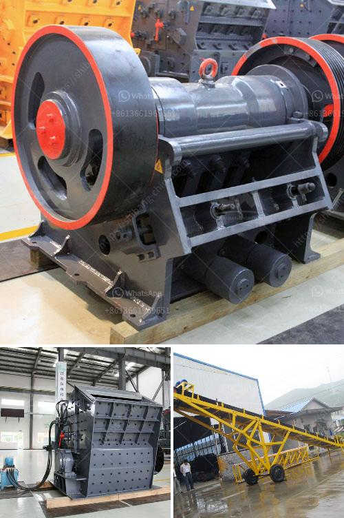

<h3>quarry mining business plan pdf</h3>
Quarry mining is a highly lucrative business that involves extracting valuable minerals or other geological materials from the earth. Different types of minerals and stones need to be mined from various kinds of rock formations, making it essential for quarry mining business owners to have an organized and detailed business plan.

A quarry mining business plan pdf provides an essential tool for evaluating the feasibility of starting a quarry mining operation. It includes information on the mining and processing of mineral and stone products, budgeting and financial projections, market analysis, and marketing strategies.

An effective quarry mining business plan pdf will help you monitor progress and improve operations by identifying potential areas of waste and inefficiency. It also serves as a blueprint for guiding your decision-making process as you consider investments, expand into new markets, or collaborate with other companies.

2. Company Description: Detailed information about your company, its history, and the industry it operates in.

3. Market Analysis: A systematic study of the external factors that may affect your quarry mining business, including competition, target market, and demand for specific minerals or stones.

4. Organizational Structure: An outline of how your company is structured, including key roles and responsibilities.

5. Product Analysis: A detailed description of the types of minerals or stones you plan to quarry and how they will be processed and sold.

6. Marketing Strategies: A plan for promoting your products and attracting customers, including pricing, distribution, and advertising strategies.

7. Financial Projections: A comprehensive financial plan that outlines revenue, expenses, and projected profits over a certain period.

By creating a detailed quarry mining business plan, you can ensure that your operation is sustainable and profitable in the long run.
<h3>Contact us</h3><ul><li><strong>Whatsapp:&nbsp;<a href="https://wa.me/8613661969651">+8613661969651</a></strong></li><li><a href="https://swt.shibang-china.com/?git&amp;zhl&amp;quarry mining business plan pdf"><strong>Online Service(chat now)</strong></a></li></ul><h3>Related</h3><ul><li><a href='slag grinding mill india.md'>slag grinding mill india</a></li><li><a href='dolomite processing plan in ethiopia.md'>dolomite processing plan in ethiopia</a></li><li><a href='alluvial gold washing plant in zimbabwe.md'>alluvial gold washing plant in zimbabwe</a></li><li><a href='grinding media charge calculation in cement ball mills.md'>grinding media charge calculation in cement ball mills</a></li><li><a href='ball mill in kazakhstan.md'>ball mill in kazakhstan</a></li></ul>