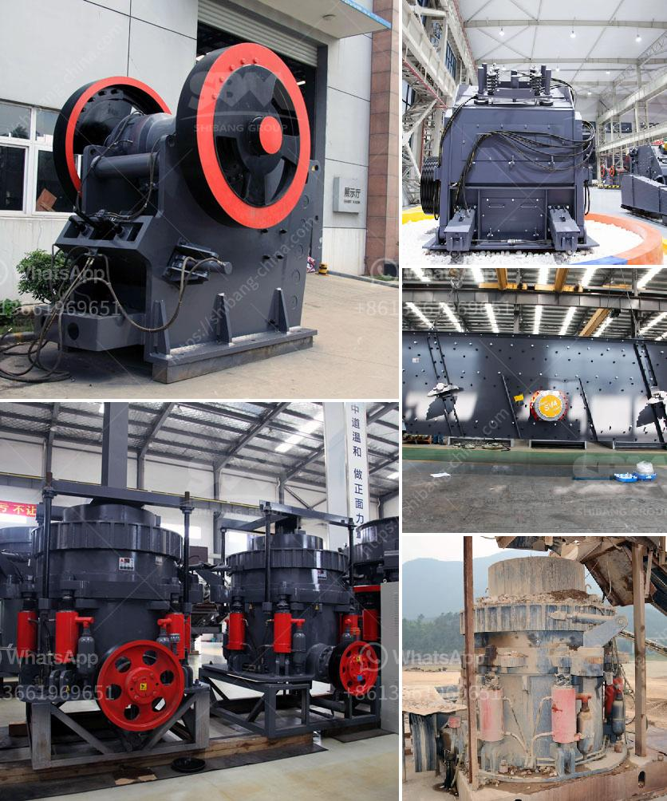

<h3>quarry operations business plan</h3>
The quarry operations business plan is an essential tool for any quarry business. It outlines your goals, strategies, and the blueprints for how you will achieve those goals. The plan not only helps you to effectively manage your quarry operation, but it also assists in identifying potential risks and opportunities for growth.

One of the first steps in developing a quarry business plan is to evaluate the market and determine if there is enough demand for the product. This involves conducting a thorough market analysis to assess the current state of the industry and identify potential customers. It is also important to determine what sets your quarry apart from the competition. This could be factors such as the quality of the material, efficient production methods, or strategic location.

Once you have a clear understanding of the market, it is imperative to define your objectives. These could range from increasing annual production output to expanding the customer base. The objectives should be specific, measurable, achievable, relevant, and time-bound (SMART). This will allow you to track progress and make necessary adjustments along the way.

Another crucial component of the quarry operations business plan is the development of a comprehensive operational strategy. This involves outlining the processes involved in quarrying, including extraction, crushing, screening, and transportation of the material. It is important to carefully plan the sequence of activities to minimize costs and ensure maximum efficiency.

The operational strategy should also detail the equipment and machinery required for the quarrying process. This includes inventory management, maintenance plans, and strategies for sourcing spare parts. Additionally, it is essential to address health and safety protocols to ensure a safe working environment for employees.

Financial planning is another critical aspect of the quarry operations business plan. This involves creating a detailed budget, forecasting revenue streams, and estimating expenses. It is important to consider the initial investment required for the quarry establishment and ongoing operating costs. This will help determine the financial viability of the business and guide decision-making processes.

Furthermore, the business plan should address marketing and sales strategies. This includes identifying target markets, developing promotional campaigns, and establishing relationships with potential customers. It is essential to determine the most effective channels for marketing your quarry product, whether it be through direct sales, distributors, or online platforms.

Lastly, the quarry operations business plan should include a risk assessment and contingency plan. This involves identifying potential threats to the business, such as changes in market conditions, regulatory factors, or environmental concerns. By developing a contingency plan, you can minimize the impact of unforeseen events and ensure the continuity of operations.

In conclusion, a quarry operations business plan serves as a roadmap for success. It allows quarry owners to strategically plan their business, set achievable goals, and manage risks. By carefully considering market conditions, developing efficient operational strategies, and conducting thorough financial planning, quarry operators can maximize profitability and create a thriving business in a competitive industry.
<h3>Contact us</h3><ul><li><strong>Whatsapp:&nbsp;<a href="https://wa.me/8613661969651">+8613661969651</a></strong></li><li><a href="https://swt.shibang-china.com/?git&amp;zhl&amp;quarry operations business plan"><strong>Online Service(chat now)</strong></a></li></ul><h3>Related</h3><ul><li><a href='screens hammer mills.md'>screens hammer mills</a></li><li><a href='construction crusher price.md'>construction crusher price</a></li><li><a href='ton per hour hammer mill grinding mill china.md'>ton per hour hammer mill grinding mill china</a></li><li><a href='feeding stone crushers.md'>feeding stone crushers</a></li><li><a href='granite crusher in.md'>granite crusher in</a></li></ul>