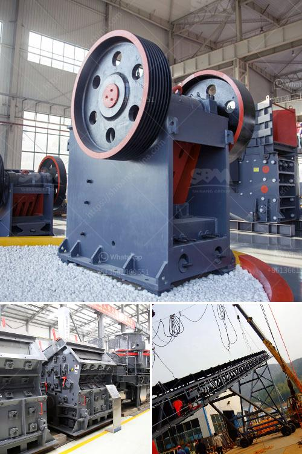

<h3>quarry plant equipments and costs</h3>
A quarry plant is a crucial part of any construction or mining business. Its primary function is to break down stones into smaller sizes that can be used in various construction projects such as roads, buildings, bridges, and railways. To achieve this, a quarry plant requires several equipment and machinery that must work together efficiently. In this article, we will discuss essential quarry plant equipment and associated costs.

Primary crusher: One of the most critical pieces of equipment in a quarry plant is the primary crusher. It is responsible for reducing the size of the blasted rocks to a manageable size. Common types of primary crushers include jaw crushers, gyratory crushers, and impact crushers. Jaw crushers are most commonly used due to their simplicity and efficiency. The cost of a primary crusher can range from $5,000 to $200,000 or more, depending on its capacity and features.

Secondary crusher: After the primary crusher, the secondary crusher further reduces the size of the stones to the desired size for the specific construction project. Common types of secondary crushers include cone crushers and impact crushers. Cone crushers are known for their ability to produce finely crushed end products. The cost of a secondary crusher can range from $10,000 to $200,000 or more.

Screening equipment: Screening equipment is used to separate the crushed stones into different sizes. It consists of a vibrating screen, which is commonly used to divide the crushed stones into different categories based on their size. The cost of screening equipment can vary depending on the capacity and features, ranging from $10,000 to $150,000.

Conveying system: A conveying system is essential to transport the crushed stones from one area of the quarry plant to another. It consists of conveyor belts, hopper feeders, and other related equipment. The cost of a conveying system can range from $10,000 for a simple setup to $500,000 for a more complex and automated system.

Loader and excavator: Loaders and excavators are used to load the stones onto trucks for transportation. These machines are crucial for the efficient operation of a quarry plant. The cost of a loader or excavator can range from $50,000 to $500,000 or more, depending on its size and capabilities.

Dust suppression system: Dust is a common byproduct of crushing and screening operations in a quarry plant. To comply with environmental regulations and ensure a safe working environment, a dust suppression system is necessary. The cost of a dust suppression system can range from $10,000 to $50,000 or more.

Maintenance and operational costs: Apart from the initial purchase cost of the equipment, it is crucial to consider ongoing maintenance and operational costs. Regular maintenance is essential to ensure the efficiency and longevity of the equipment. Operational costs, such as fuel, lubricants, and electricity, also need to be factored in when calculating the overall costs of a quarry plant.

In conclusion, setting up and operating a quarry plant involves significant investment in various equipment and machinery. The costs can vary depending on the size of the operation, the type of equipment chosen, and the specific requirements of the construction projects. It is crucial to carefully assess these factors and consider the long-term benefits and return on investment before making any decisions.
<h3>Contact us</h3><ul><li><strong>Whatsapp:&nbsp;<a href="https://wa.me/8613661969651">+8613661969651</a></strong></li><li><a href="https://swt.shibang-china.com/?git&amp;zhl&amp;quarry plant equipments and costs"><strong>Online Service(chat now)</strong></a></li></ul><h3>Related</h3><ul><li><a href='mineral materials crusher.md'>mineral materials crusher</a></li><li><a href='mobile crusher specification.md'>mobile crusher specification</a></li><li><a href='crushers for rent in oman.md'>crushers for rent in oman</a></li><li><a href='slag crusher manufacturer.md'>slag crusher manufacturer</a></li><li><a href='cone crusher manufacturer.md'>cone crusher manufacturer</a></li></ul>