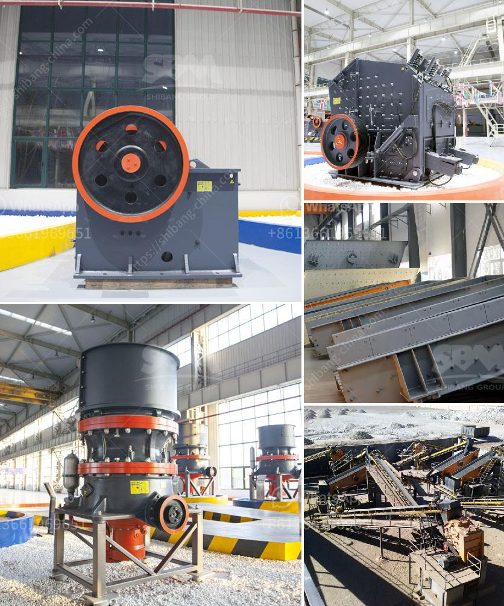

<h3>quarry stone business plan in zimbabwe</h3>
Starting a new business project is always exciting, but it requires careful planning and understanding of the market. Launching a successful quarry stone business is no exception. The quarry stone business plan in Zimbabwe involves a great deal of meticulousness and planning.

Zimbabwe's mining industry is focused on a diverse range of small to medium mining operations. The most important minerals produced by Zimbabwe include gold, asbestos, chromite, coal and base metals. The mining industry contributes approximately 8% towards the country's GDP. SBM Crusher for Mining Industry in Zimbabwe

The first step in quarrying is to gain access to the granite deposit. This is processed by removing the overburden materials on the surface of the deposits. The overburden is then delivered to onsite storage for potential use in later reclamation of the site.

Shanghai SBM Mining and Construction Machinery Co., Ltd. provides the complete range of quarry crushing and grinding plant for sale. Zimbabwe is particularly known for its resources of platinum group of minerals (PGMs) as well as nickel, gold, diamonds and others.

The mining industry in Zimbabwe is expected to continue growing on the back of firming mineral prices and rising output in 2022. The country's mining industry is expected to grow by 10% in 2020, owing to increased exploration activity and expansion programs.

The Zimbabwean government has recently prioritized its mining industry with the aim of increasing mineral exports to $12 billion by 2023. This is a crucial plan and shows that the country is investing in infrastructure development.

For a rock quarry business in Zimbabwe, the benefits of building a quarry station are significant. Firstly, there is a great exploration potential. The rock quarry plant can be accessed from Zvishavane by several gravel roads, which include 4.6 km to the west, leading to the Guruve area and connecting Harare-Bulawayo highway.

Additionally, the workforce is less expensive compared to the United States or Australia, making labor costs significantly lower. This will give the business a competitive advantage in terms of pricing and profitability.

Moreover, Zimbabwe's central location within Southern Africa offers easy access to key regional markets, such as South Africa, Mozambique, Zambia, and Botswana. Having a strategic location is crucial for any quarry stone business to thrive.

To ensure the success of your quarry stone business in Zimbabwe, you need to provide the best quality products to your customers. The inputs required for quarry stones production are explosives, power, and water. The quarry fabrication process includes removal of stone blocks from the deposit and hauling them to the fabrication area.

Once the blocks are obtained, they are further transformed into usable products through cutting, polishing, and finishing. The final products are then transported to the market. Consider investing in high-quality machinery and equipment to ensure efficient and consistent production.

In conclusion, the quarry stone business is a profitable business venture and it is open for any aspiring entrepreneur to come in and establish his or her business; you can chose to start on a small scale on a large scale with robust distribution network all across major construction sites and cement factories in Zimbabwe.

This article provides a general overview of the quarry stone business plan in Zimbabwe. For more information on the business, you can conduct further research through the Chamber of Mines and Quarry Association of Zimbabwe.
<h3>Contact us</h3><ul><li><strong>Whatsapp:&nbsp;<a href="https://wa.me/8613661969651">+8613661969651</a></strong></li><li><a href="https://swt.shibang-china.com/?git&amp;zhl&amp;quarry stone business plan in zimbabwe"><strong>Online Service(chat now)</strong></a></li></ul><h3>Related</h3><ul><li><a href='jaw crusher 400 x.md'>jaw crusher 400 x</a></li><li><a href='aggregate crushing machines.md'>aggregate crushing machines</a></li><li><a href='roll grinders manufacturers.md'>roll grinders manufacturers</a></li><li><a href='crusher manufacturer in pune.md'>crusher manufacturer in pune</a></li><li><a href='quartz powder suppliers in dubai.md'>quartz powder suppliers in dubai</a></li></ul>