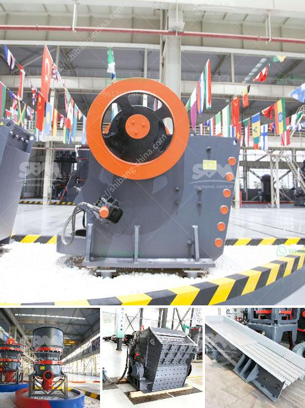

<h3>quartz ball mill machinery</h3>
Quartz ball mill machinery is used to grind quartz into powder in various industries such as mining, building materials, and chemical engineering. The production process of quartz powder involves a series of crushers, grinders, and mills, which are used to reduce the size of large-sized quartz stones to the required particle size.

One of the main components of a quartz ball mill is a rotating cylinder filled with quartz balls. As the cylinder rotates, the balls inside the mill continuously grind quartz particles into finer powder. The end product is a fine quartz powder with uniform particle size, which is highly sought after in the production of various industrial products.

The quartz ball mill machinery is available in different specifications and configurations to meet the diverse needs of customers. It can be used for dry or wet grinding, which makes it suitable for both continuous and batch grinding. Depending on the specific application and requirements, the quartz ball mill can have lining materials such as rubber, steel, or ceramic to prevent contamination of the final product.

The advantages of quartz ball mill machinery are multiple. Firstly, it provides a cost-effective solution for quartz powder production. Compared to other grinding equipment, the quartz ball mill has a low operation cost, saving energy and reducing consumption.

Secondly, the quartz ball mill machinery has a high grinding efficiency. The rotation of the cylinder and the grinding media within it generate frictional force and impact force, resulting in the efficient grinding of quartz particles. This high grinding efficiency ensures that the final product has a consistent particle size and a high purity level.

Furthermore, the quartz ball mill machinery is easy to operate and maintain. It requires minimal supervision, reducing labor costs and increasing production efficiency. Regular maintenance tasks such as lubrication and inspection can be easily performed, prolonging the service life of the machine.

Moreover, the quartz ball mill can be customized to meet specific needs. It can accommodate different capacities, ranging from a few kilograms to several tons per hour. The adjustable speed and grinding time allow for precise control over the grinding process, ensuring optimal results.

In conclusion, quartz ball mill machinery plays a crucial role in the quartz powder production process. It offers a cost-effective and efficient solution for grinding quartz stones into fine powder. With its high grinding efficiency, easy operation, and low maintenance requirements, the quartz ball mill machinery is an indispensable tool for various industries.
<h3>Contact us</h3><ul><li><strong>Whatsapp:&nbsp;<a href="https://wa.me/8613661969651">+8613661969651</a></strong></li><li><a href="https://swt.shibang-china.com/?git&amp;zhl&amp;quartz ball mill machinery"><strong>Online Service(chat now)</strong></a></li></ul><h3>Related</h3><ul><li><a href='ball mill in egypt.md'>ball mill in egypt</a></li><li><a href='iron processing plant price.md'>iron processing plant price</a></li><li><a href='crushing plant application.md'>crushing plant application</a></li><li><a href='limestone grinding technology and.md'>limestone grinding technology and</a></li><li><a href='providers conveyor belts in mexico.md'>providers conveyor belts in mexico</a></li></ul>