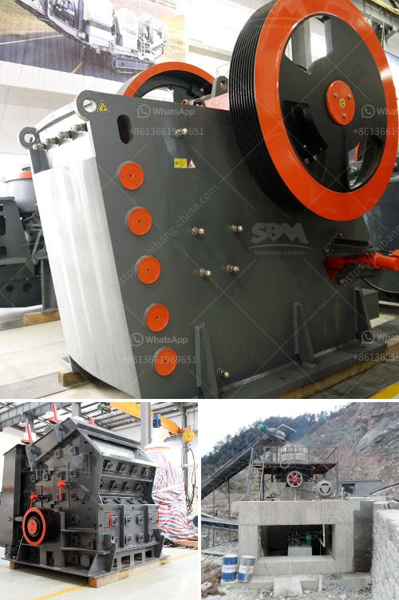

<h3>quartz crushing suppliers</h3>
Quartz is a mineral that is widely found in various geological formations across the globe. Due to its abundance and diverse uses, it has become an essential component in many industries, such as manufacturing, construction, and electronics. Quartz crushing suppliers play a crucial role in providing the necessary raw materials for these industries.

Quartz crushing suppliers are businesses or individuals who extract quartz from mines or quarries and then crush it into different sizes or forms. The process involves using heavy machinery and equipment to break down large quartz rocks into smaller, more manageable pieces. These crushed quartz pieces are then sold to various industries that require quartz as an essential ingredient.

The demand for quartz is ever-increasing, mainly due to its unique properties such as its hardness, durability, and chemical inertness. In the manufacturing industry, crushed quartz is often used as an abrasive material for grinding, cutting, and polishing. It is also used in the production of glass, ceramics, and other refractory materials.

The construction industry relies heavily on crushed quartz for the production of concrete, asphalt, and other construction materials. The crushed quartz provides strength and durability to these construction materials and helps them withstand harsh weather conditions and heavy loads.

Additionally, crushed quartz is also widely used in the electronics industry for the production of semiconductors, solar panels, and other electronic components. The high purity of quartz makes it an excellent material for these applications.

Quartz crushing suppliers play a vital role in ensuring a continuous supply of high-quality quartz to these industries. They invest in modern machinery and technology to ensure efficient and cost-effective extraction and crushing processes. They also follow strict quality control measures to ensure that the crushed quartz meets industry standards and customer requirements.

In conclusion, quartz crushing suppliers play a crucial role in providing the essential raw materials required by various industries. Their efficient extraction and crushing processes enable the industries to access high-quality quartz, which is necessary for their operations. The continuous supply of crushed quartz ensures the growth and development of these industries in a sustainable and environmentally friendly manner.
<h3>Contact us</h3><ul><li><strong>Whatsapp:&nbsp;<a href="https://wa.me/8613661969651">+8613661969651</a></strong></li><li><a href="https://swt.shibang-china.com/?git&amp;zhl&amp;quartz crushing suppliers"><strong>Online Service(chat now)</strong></a></li></ul><h3>Related</h3><ul><li><a href='coconut shell powder machine project report.md'>coconut shell powder machine project report</a></li><li><a href='msme ball mill project report.md'>msme ball mill project report</a></li><li><a href='distributor jaw crusher merk khong chuan.md'>distributor jaw crusher merk khong chuan</a></li><li><a href='gold mining equipments manufacturers.md'>gold mining equipments manufacturers</a></li><li><a href='how to build a hammer mill.md'>how to build a hammer mill</a></li></ul>