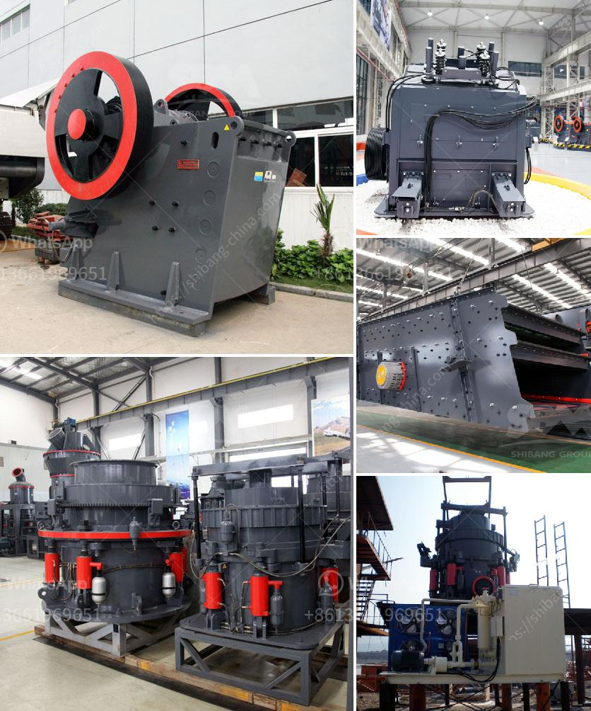

<h3>quartz grits plant machinery</h3>
Quartz grits, also known as quartz sand or quartz powder, are a type of quartz export products used in a variety of industries. They are an essential raw material for the production of glass, ceramics, and other industrial products. With the growing demand for high-quality quartz grits, the need for advanced machinery to produce them efficiently has become crucial.

A quartz grits plant machinery is a facility that grinds and processes quartz rocks into the desired form. These plants usually consist of jaw crushers, cone crushers, vertical shaft impactors (VSI), and vibrating screens. The raw quartz rocks are initially crushed to a desired size using a jaw crusher. This primary crushing process ensures that the quartz grits have uniform size and shape.

The crushed quartz rocks then go through a secondary crushing process using cone crushers. Cone crushers are known for their high crushing efficiency and ability to produce a well-graded product. They further reduce the size of the quartz grits, making them suitable for various applications.

After the secondary crushing process, vertical shaft impactors (VSI) are used to shape the quartz grits to the desired form. VSIs are particularly effective in producing cubical particles, which are highly sought after in the manufacturing of glass and ceramics. The VSI machines use rapid rotating impellers to create a high velocity of materials, resulting in the desired shape and size of quartz grits.

Vibrating screens are an important part of the quartz grits plant machinery. These screens are used to separate the crushed materials into different size fractions. The vibrating screens consist of multiple layers of screens with various opening sizes. This ensures that the quartz grits are screened properly, and only the desired particle sizes are passed on for further processing.

Furthermore, modern quartz grits plant machinery incorporates advanced automation systems to improve productivity and efficiency. These systems control the various processes and machines, optimizing them for maximum output. Automation also helps in reducing human error and ensures consistent quality in the produced quartz grits.

In addition to the primary machinery, there are various auxiliary equipment used in quartz grits plants. These include conveyors, feeders, and storage bins to handle and transport the crushed quartz rocks. Dust control systems are also essential to maintain a clean and safe working environment.

Overall, the quartz grits plant machinery plays a crucial role in processing raw quartz rocks into high-quality quartz grits. With the increasing demand for quartz products across industries, investing in advanced machinery is necessary to meet the market requirements. These plants offer an efficient and cost-effective solution for producing quartz grits with the desired size, shape, and quality. By incorporating modern machinery and automation systems, manufacturers can ensure the consistent supply of superior quartz grits, contributing to the growth of various industries.
<h3>Contact us</h3><ul><li><strong>Whatsapp:&nbsp;<a href="https://wa.me/8613661969651">+8613661969651</a></strong></li><li><a href="https://swt.shibang-china.com/?git&amp;zhl&amp;quartz grits plant machinery"><strong>Online Service(chat now)</strong></a></li></ul><h3>Related</h3><ul><li><a href='list of stone crusher plant in bangladesh.md'>list of stone crusher plant in bangladesh</a></li><li><a href='machine cost for cement production plant machine.md'>machine cost for cement production plant machine</a></li><li><a href='jual belt conveyor surabaya.md'>jual belt conveyor surabaya</a></li><li><a href='limestone grinding mill unit manufacturers.md'>limestone grinding mill unit manufacturers</a></li><li><a href='crushing machine manufacturer.md'>crushing machine manufacturer</a></li></ul>