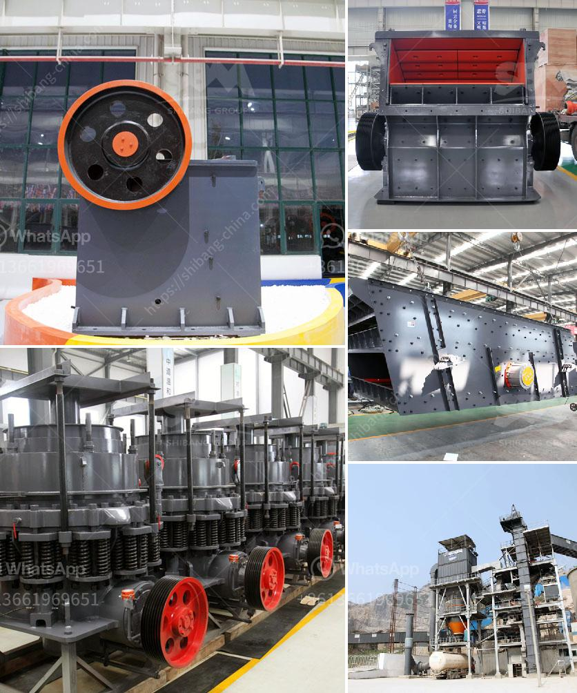

<h3>quartz making machine germany</h3>
Quartz, a mineral renowned for its durability and beauty, has become a popular choice for countertops, flooring, and various other applications in recent years. Germany, known for its precision engineering and innovative technology, has emerged as a leader in the production of quartz making machines. These machines, also known as quartz stone or engineered stone machines, are responsible for transforming raw quartz into stunning slabs that are highly sought after in the construction and interior design industries. Let's take a closer look at the incredible technology and craftsmanship behind these German-made machines.

One of the key players in the German quartz making machine industry is Breton, based in Northern Italy but with a strong presence in Germany. Breton is renowned for its state-of-the-art machines that combine cutting-edge technology with German engineering expertise. Their machines are designed to offer high productivity, precision, and energy efficiency, which are crucial factors for any manufacturer looking to stay competitive in the market.

One of the standout features of German quartz making machines is their ability to handle large-scale production. These machines can process a wide range of quartz materials in various sizes and thicknesses. Whether it's a small residential project or a massive commercial development, German machines can cater to the needs of any customer. The sophisticated software integrated into these machines allows for efficient control and management of the entire production process, ensuring consistency and quality.

Quality is of utmost importance in the quartz making industry, as customers demand flawlessly finished slabs that meet their exact specifications. German machines excel in delivering just that. They are equipped with diamond-tipped blades and polishing tools that work with utmost precision to create smooth, mirror-like surfaces. The advanced technology prevents any wastage during the cutting and polishing processes, optimizing the use of raw materials and reducing production costs.

The durability of quartz slabs is another reason why German-made machines have gained a strong reputation. Quartz is a dense and non-porous material, making it highly resistant to stains, scratches, and heat. Thanks to the precise engineering and advanced manufacturing techniques employed by German machines, the slabs produced are incredibly durable, ensuring a long-lasting and low-maintenance solution for homeowners and businesses alike.

Environmental consciousness is a growing concern across industries, and the quartz making sector is no exception. With Germany being at the forefront of sustainable initiatives, it's no surprise that German-made quartz making machines prioritize energy efficiency and reduced environmental impact. These machines are designed to consume less energy, produce minimal waste, and utilize water and other resources efficiently. This not only helps manufacturers in meeting their sustainability goals but also makes them more appealing to environmentally conscious customers.

In conclusion, Germany is undoubtedly a leader in the quartz making machine industry. Through a combination of cutting-edge technology, precision engineering, and a commitment to quality and sustainability, German-made machines have set a new standard in the market. These machines not only offer high productivity and flawless finishes but also provide durable and environmentally friendly solutions. As the demand for quartz continues to grow, German quartz making machines will undoubtedly remain at the forefront of the industry, providing top-notch products for homes and businesses around the world.
<h3>Contact us</h3><ul><li><strong>Whatsapp:&nbsp;<a href="https://wa.me/8613661969651">+8613661969651</a></strong></li><li><a href="https://swt.shibang-china.com/?git&amp;zhl&amp;quartz making machine germany"><strong>Online Service(chat now)</strong></a></li></ul><h3>Related</h3><ul><li><a href='jaw crusher thailand.md'>jaw crusher thailand</a></li><li><a href='crusher plant in turkey.md'>crusher plant in turkey</a></li><li><a href='kenya stone crusher.md'>kenya stone crusher</a></li><li><a href='sand grinding mill japan for sale.md'>sand grinding mill japan for sale</a></li><li><a href='aggregate production plant pdf.md'>aggregate production plant pdf</a></li></ul>