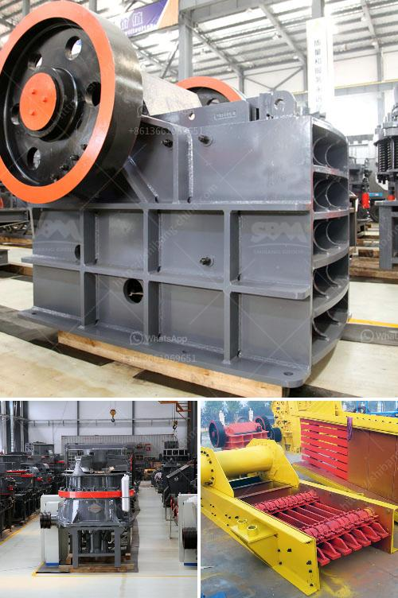

<h3>quartz powder buyers 300 mesh</h3>
Quartz powder, a versatile and widely used mineral, has multiple industrial applications across various sectors. One specific variation in demand is for quartz powder buyers seeking the 300 mesh variety. With its fine consistency and high level of purity, 300 mesh quartz powder holds immense value in industries like glass manufacturing, ceramics, construction, and more.

The 300 mesh size refers to the screen size through which the quartz particles pass during the grinding process. It signifies that the powder has been finely ground, resulting in a smooth texture and enhanced chemical composition. This particular grade of quartz powder is highly sought after due to its ability to enhance the physical and chemical properties of end products.

Glass manufacturers, for instance, rely on 300 mesh quartz powder as a vital ingredient in their production process. It imparts clarity, strength, and durability to glass products while also serving as a flux during the melt. The exceptional thermal stability of this powder allows it to withstand high temperatures, making it an ideal choice for refractory applications.

Ceramic manufacturers also find great value in using 300 mesh quartz powder. Its high silica content provides excellent moldability and acts as a binder, ensuring improved hardness and uniformity in the final ceramic products. Additionally, quartz powder buyers from construction and paint industries utilize this fine-grade quartz powder to enhance the strength and durability of building materials.

In recent years, the demand for 300 mesh quartz powder has seen a steady rise, spurring an increase in the number of buyers in the market. As a result, suppliers worldwide are focusing on meeting this demand, ensuring a continuous supply of high-quality quartz powder in the specified mesh size.

For quartz powder buyers, it is crucial to consider factors such as the authenticity of suppliers, pricing, and delivery timelines. Reputable suppliers maintain strict quality control measures, ensuring that each batch meets the required specifications. Additionally, they provide detailed product information and technical support to assist buyers in making informed decisions.

In conclusion, the demand for 300 mesh quartz powder is on the rise, driven by its versatility and exceptional properties. With a plethora of applications in various industries, quartz powder buyers can benefit greatly from this fine-grade product. It is essential to collaborate with reliable suppliers who can meet the quality standards and fulfill the specific requirements of the buyers. As the market continues to grow, the quartz powder industry is set to witness further advancements and innovations to cater to the evolving needs of buyers in the global market.
<h3>Contact us</h3><ul><li><strong>Whatsapp:&nbsp;<a href="https://wa.me/8613661969651">+8613661969651</a></strong></li><li><a href="https://swt.shibang-china.com/?git&amp;zhl&amp;quartz powder buyers 300 mesh"><strong>Online Service(chat now)</strong></a></li></ul><h3>Related</h3><ul><li><a href='crushers of germany.md'>crushers of germany</a></li><li><a href='conveyor belts contacts.md'>conveyor belts contacts</a></li><li><a href='ball mill in kazakhstan.md'>ball mill in kazakhstan</a></li><li><a href='sand washing plant suppliers.md'>sand washing plant suppliers</a></li><li><a href='typical flow sheet for granite quarry.md'>typical flow sheet for granite quarry</a></li></ul>