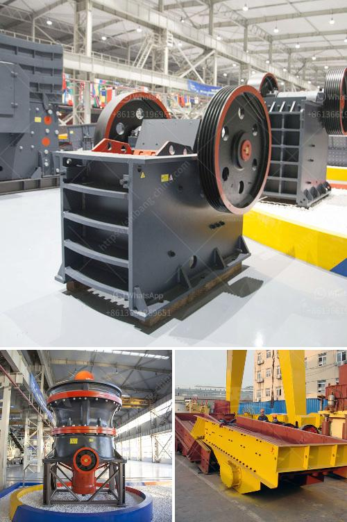

<h3>quartz powder plant in india</h3>
Quartz is one of the most abundant minerals on Earth and is found in different geological formations. It is a versatile mineral used in various industries, including the construction, glass-making, ceramics, and electronics industries. In India, quartz is extensively used in the manufacturing of quartz powder, a fine-grained sand-like substance obtained by grinding quartz.

One of the leading countries in quartz production, India has a vibrant quartz powder plant industry. These plants extract rough quartz stones from mines and transform them into small, granular particles through the process of grinding. These particles are then used in different industrial applications.

The quartz powder plant industry in India has seen significant growth over the years due to the country's rich reserves of high-quality quartz ore. Several states in India, including Andhra Pradesh, Rajasthan, Gujarat, and Tamil Nadu, are known for their abundant quartz mines. These mines provide the raw material needed for the quartz powder manufacturing process.

The process of producing quartz powder starts with the extraction of quartz stones from the mines. Large-scale mining operations are carried out to obtain quartz ore, which is then transported to the quartz powder plants for processing. In these plants, the ore is initially crushed into smaller pieces using crushers or grinders.

After the initial crushing process, the ore goes through further grinding to transform it into fine powder. This grinding process involves the use of ball mills or other specialized equipment that rotates and crushes the ore into smaller sizes. These machines ensure that the quartz powder has a uniform texture and particle size, making it suitable for various applications.

Once the grinding process is complete, the quartz powder is carefully inspected to ensure its quality and purity. It is then packed and stored in large quantities to be distributed to different industries. The demand for quartz powder in India is high, and the plants work tirelessly to meet these demands.

The quartz powder plant industry plays a crucial role in supporting various sectors of the Indian economy. For instance, in the construction industry, quartz powder is used as an essential ingredient in the manufacturing of concrete, tiles, and other building materials. Its high strength and durability make it an ideal inclusion in construction projects.

In the electronics industry, quartz powder is used in the production of semiconductors and circuit boards. Its unique electrical properties, such as piezoelectricity and pyroelectricity, make it an indispensable material for electronic devices.

Furthermore, the glass and ceramics industries heavily rely on quartz powder as a raw material. It is used in the manufacturing of glass products, such as windows, bottles, and lenses, as well as ceramic products, including tiles, sanitaryware, and pottery.

In conclusion, the quartz powder plant industry in India plays a vital role in supporting various sectors of the economy. With its rich reserves of high-quality quartz ore, India has established itself as a prominent player in global quartz production. The quartz powder produced in these plants caters to the needs of industries like construction, electronics, glass, and ceramics. The industry contributes to India's economic growth and provides employment opportunities for many people involved in the mining and processing of quartz.
<h3>Contact us</h3><ul><li><strong>Whatsapp:&nbsp;<a href="https://wa.me/8613661969651">+8613661969651</a></strong></li><li><a href="https://swt.shibang-china.com/?git&amp;zhl&amp;quartz powder plant in india"><strong>Online Service(chat now)</strong></a></li></ul><h3>Related</h3><ul><li><a href='limestone production plant.md'>limestone production plant</a></li><li><a href='costruire une machine pour broyer des briques.md'>costruire une machine pour broyer des briques</a></li><li><a href='mobile crusher price list.md'>mobile crusher price list</a></li><li><a href='quartz stone lining machinery.md'>quartz stone lining machinery</a></li><li><a href='how much does gold ore cost.md'>how much does gold ore cost</a></li></ul>