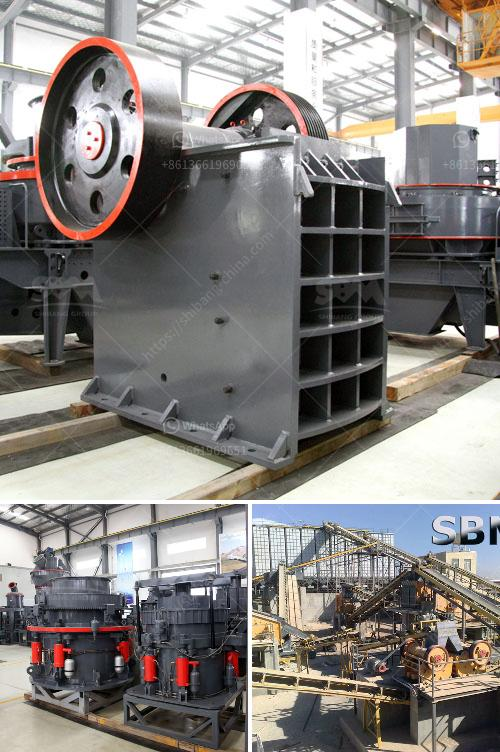

<h3>quartz powder suppliers in dubai</h3>
Dubai, known for its towering skyscrapers and extravagant lifestyle, is also home to several quartz powder suppliers. Quartz powder is a key ingredient in various industrial applications, including ceramics, glass manufacturing, and construction. These suppliers in Dubai offer a wide range of high-quality quartz powder that is sought after by local and international customers.

One of the prominent quartz powder suppliers in Dubai is ABC Minerals. With years of experience in the industry, ABC Minerals has established itself as a reliable and efficient supplier. They source their quartz powder from trusted mines around the world, ensuring top-notch quality. ABC Minerals takes pride in their state-of-the-art facilities that enable them to produce quartz powder in different grades to cater to diverse customer requirements.

Another renowned supplier is XYZ Quartz. This company boasts a strong reputation for delivering superior quality quartz powder to clients in Dubai. They maintain strict quality control measures throughout the production process, guaranteeing consistent and high-purity quartz powder. XYZ Quartz also offers tailored solutions to meet specific customer needs, making them a preferred choice for buyers seeking custom-made quartz powder.

Quartz Trading Co is another reputable supplier based in Dubai. They specialize in supplying premium-grade quartz powder to a wide array of industries. Their products are known for their exceptional whiteness and excellent chemical properties. Quartz Trading Co places great emphasis on customer satisfaction, providing prompt and reliable service.

The availability of these trusted quartz powder suppliers in Dubai has been instrumental in supporting various industries' growth. Their commitment to quality, reliable delivery, and customer satisfaction has cemented their position as the go-to providers of quartz powder in the region.

In conclusion, Dubai is home to several reliable and reputable quartz powder suppliers. These suppliers play a crucial role in meeting the demand for high-quality quartz powder for various industrial applications. With their top-notch products and customer-centric approach, these suppliers have established themselves as leaders in the market, providing valuable solutions to industry players.
<h3>Contact us</h3><ul><li><strong>Whatsapp:&nbsp;<a href="https://wa.me/8613661969651">+8613661969651</a></strong></li><li><a href="https://swt.shibang-china.com/?git&amp;zhl&amp;quartz powder suppliers in dubai"><strong>Online Service(chat now)</strong></a></li></ul><h3>Related</h3><ul><li><a href='cement grinding mill suppliers.md'>cement grinding mill suppliers</a></li><li><a href='construction crusher price.md'>construction crusher price</a></li><li><a href='impact of fator on coal crusher.md'>impact of fator on coal crusher</a></li><li><a href='starting a quarry business in nigeria.md'>starting a quarry business in nigeria</a></li><li><a href='prices of crusher machine in pakistan.md'>prices of crusher machine in pakistan</a></li></ul>