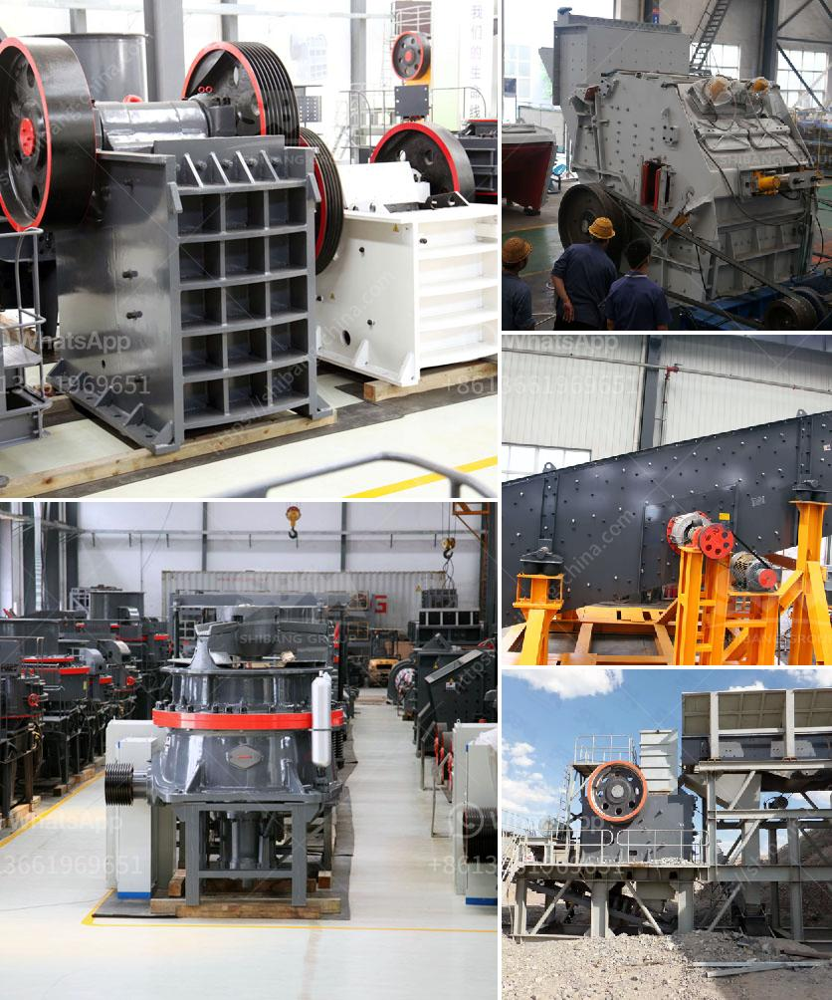

<h3>quartz processing machine up to 300 mesh</h3>
Quartz is a versatile mineral with various industrial applications, ranging from construction materials to electronics. To harness its full potential, it often needs to be processed into fine particles. The advent of quartz processing machines revolutionized the industry by allowing efficient and precise processing up to 300 mesh. However, recent advancements have pushed the boundaries even further, allowing for processing up to 300 mesh and beyond.

One major development in quartz processing machines is the use of state-of-the-art technology for grinding and polishing. These advanced machines utilize cutting-edge tools and techniques to achieve finer particle sizes. By optimizing the grinding process, manufacturers can now produce quartz particles with sizes as low as 300 mesh, ensuring a high degree of consistency and quality.

The increased demand for finer quartz particles stemmed from its applications in industries such as semiconductors, solar panels, and optics. For instance, in the electronics industry, quartz particles are used as fillers in epoxy molding compounds or as abrasives in precision polishing. The ability to process quartz up to 300 mesh ensures the production of ultra-fine particles suitable for such intricate applications.

Moreover, advancements in quartz processing machines have enabled the production of particles beyond 300 mesh. This has opened doors to new opportunities in industries that require even finer particles, such as pharmaceuticals and cosmetics. In cosmetic applications, quartz particles are used in products like powders, foundations, and exfoliating scrubs. The ability to process quartz up to 500 mesh guarantees the production of ultra-fine particles, enhancing the texture and performance of cosmetic formulations.

Another significant development in quartz processing machines is the integration of automated processes. Automation has significantly improved productivity and accuracy, eliminating human errors and reducing processing time. With automated machines, manufacturers can seamlessly process quartz particles up to 500 mesh, ensuring a consistent and reliable output.

Furthermore, the evolution of quartz processing machines has also presented environmental benefits. With higher efficiency and precision, manufacturers can minimize material waste during the processing stage. This reduces the environmental impact associated with quartz processing, making it more sustainable and eco-friendly.

While advancements in quartz processing machines have been commendable, it is important to consider the challenges that come with processing particles beyond 300 mesh. The finer the particle size, the more delicate the handling becomes. Special care is required to avoid particle agglomeration and ensure a uniform distribution of particles. Manufacturers must invest in reliable and well-designed machinery to overcome these challenges and meet the growing demand for ultra-fine quartz particles.

In conclusion, quartz processing machines have come a long way in unlocking the potential of this versatile mineral. The ability to process quartz up to 300 mesh has revolutionized industries like electronics and construction materials. Furthermore, recent advancements have pushed the boundaries, allowing manufacturers to process quartz up to 500 mesh and beyond. The integration of cutting-edge technology, automation, and sustainable practices has made quartz processing more efficient and environmentally friendly. As the demand for finer quartz particles continues to grow, further advancements in processing machines will undoubtedly unlock new possibilities and applications in various industries.
<h3>Contact us</h3><ul><li><strong>Whatsapp:&nbsp;<a href="https://wa.me/8613661969651">+8613661969651</a></strong></li><li><a href="https://swt.shibang-china.com/?git&amp;zhl&amp;quartz processing machine up to 300 mesh"><strong>Online Service(chat now)</strong></a></li></ul><h3>Related</h3><ul><li><a href='roll ball mill manufacturers.md'>roll ball mill manufacturers</a></li><li><a href='basalt crushing equipment.md'>basalt crushing equipment</a></li><li><a href='stone crusher output.md'>stone crusher output</a></li><li><a href='crushing b vsi crusher.md'>crushing b vsi crusher</a></li><li><a href='mobile clusher for hire tanzania.md'>mobile clusher for hire tanzania</a></li></ul>