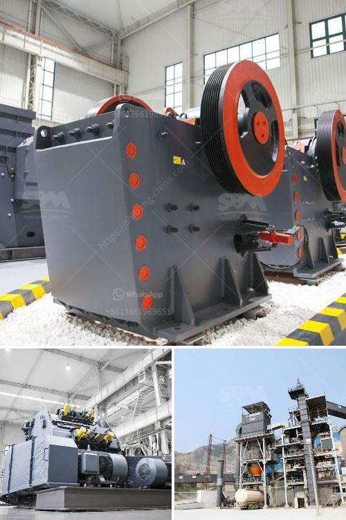

<h3>quartz production line</h3>
Quartz is a popular and versatile material used in various industries, including construction, electronics, and manufacturing. It is known for its durability, low maintenance requirements, and aesthetic appeal. To meet the increasing demand for quartz products, manufacturers have incorporated advanced production lines. These automated systems are capable of producing high-quality quartz products efficiently and in large quantities.

A quartz production line typically consists of several interconnected machines and equipment designed to perform different tasks in the manufacturing process. The process begins with the extraction of raw quartz crystals from mines or quarries. These quartz crystals are then transported to the production facility, where they undergo a series of mechanical and chemical treatments to transform them into usable quartz slabs or surfaces.

The first step in the production line is the cleaning and sorting of the raw quartz crystals. The crystals are carefully inspected for impurities and unwanted materials. Any impurities or foreign particles are removed by using specialized equipment such as vibrating screens and magnetic separators. After the cleaning process, the quartz crystals are sorted based on size and quality.

Once the sorting is complete, the quartz crystals are crushed into smaller particles of uniform size. This process is carried out using a crusher or grinder machine. The crushed quartz particles are then fed into a vibrating screen, where they are separated into different grades based on their size. The properly sized quartz particles are directed to the next stage of the production line.

The next step in the quartz production line involves mixing the crushed quartz particles with a binding agent, usually a resin. This mixture is then spread evenly onto a flat surface, such as a conveyor belt. The mixture is compacted using specialized machinery to remove any air bubbles and ensure a uniform distribution of the resin. Once compacted, the mixture is passed through a heating chamber where the resin is cured, resulting in a solid and durable quartz slab.

After the curing process, the quartz slabs undergo additional processing stages, including calibration and polishing. These stages involve grinding the slabs to achieve a uniform thickness and a smooth, glossy surface. Specialized machinery and abrasive materials are used to achieve the desired finish. The polished quartz slabs are then inspected for quality and any defects are rectified.

In the final stage of the production line, the quartz slabs are stored or packed for transportation to customers. The slabs are stacked carefully to prevent breakage during transportation. They are typically packed in wooden crates or pallets to provide additional protection.

The quartz production line, with its advanced machinery and automated processes, enables manufacturers to produce high-quality quartz products efficiently and with minimal human intervention. These production lines have significantly increased the production capacity, reduced costs, and improved product consistency. Additionally, the use of automated systems improves workplace safety and reduces the risk of injuries to workers.

In conclusion, quartz production lines have revolutionized the manufacturing process of quartz products. By incorporating advanced machinery and automated processes, manufacturers are able to meet the increasing demand for quartz products efficiently and with consistent quality. These production lines have played a crucial role in driving the growth of various industries that rely on quartz, making it a versatile and indispensable material in modern manufacturing.
<h3>Contact us</h3><ul><li><strong>Whatsapp:&nbsp;<a href="https://wa.me/8613661969651">+8613661969651</a></strong></li><li><a href="https://swt.shibang-china.com/?git&amp;zhl&amp;quartz production line"><strong>Online Service(chat now)</strong></a></li></ul><h3>Related</h3><ul><li><a href='capacity screener coal tonhcapacity stone crusher.md'>capacity screener coal tonhcapacity stone crusher</a></li><li><a href='processing of bauxite ore.md'>processing of bauxite ore</a></li><li><a href='standard ratio for cement sand building blocks.md'>standard ratio for cement sand building blocks</a></li><li><a href='ball mill catalogue.md'>ball mill catalogue</a></li><li><a href='list of stone crusher plant in bangladesh.md'>list of stone crusher plant in bangladesh</a></li></ul>