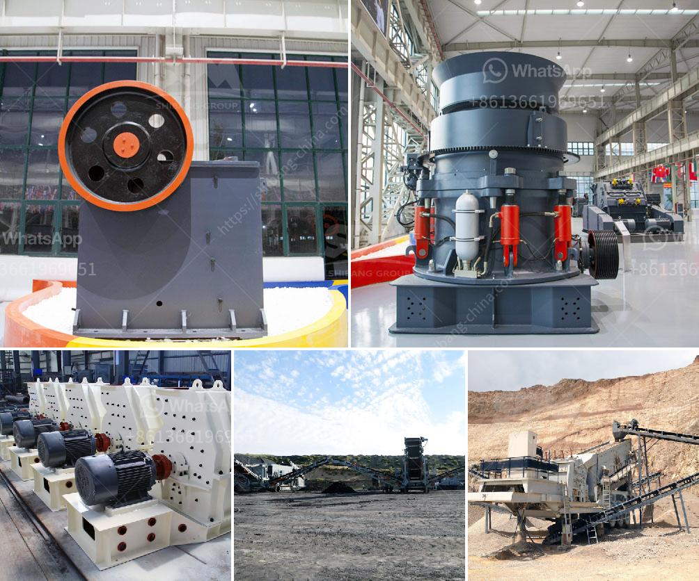

<h3>quartz sand particle size quartz powder</h3>
Quartz sand is a commonly used material in various industrial applications due to its excellent properties. One important aspect that affects its usability is the particle size of quartz sand. Quartz powder, which refers to fine particles of quartz sand, is often sought after for specific purposes.

Understanding the particle size of quartz powder is crucial because it influences its performance in different applications. The particle size distribution can range from small to large particles, and each range has distinct characteristics and uses. A fine particle size, ranging from 10 to 40 microns, is often used in the production of glass and ceramics. The small particles allow for better mixing and enhance the smoothness and transparency of the final product. Additionally, it improves the sintering behavior, resulting in stronger and more durable materials.

On the other hand, larger particle sizes, typically ranging from 100 to 300 microns, are commonly used in industries like oil and gas drilling, construction, and foundries. These coarse particles are ideal for applications where high strength and resistance against weathering are required. They provide better stability for drilling fluids in the oil and gas industry and improve the flowability and compaction of concrete in construction. In the foundry industry, they are used to create molds and cores.

The quality of quartz powder is also influenced by its particle size distribution. A narrow distribution indicates better consistency in the particle size, ensuring uniformity in the final product. This is particularly important in sensitive applications like electronics, where precise control over the size and shape of the particles is necessary for optimal performance.

In conclusion, the particle size of quartz powder plays a pivotal role in determining its applicability and performance in various industries. Understanding the specific requirements of each application allows for the selection of the appropriate particle size range, whether it be fine particles for glass and ceramics or coarse particles for drilling fluids and construction. Additionally, a consistent and narrow particle size distribution contributes to the quality and consistency of the final product, especially in applications that demand high precision.
<h3>Contact us</h3><ul><li><strong>Whatsapp:&nbsp;<a href="https://wa.me/8613661969651">+8613661969651</a></strong></li><li><a href="https://swt.shibang-china.com/?git&amp;zhl&amp;quartz sand particle size quartz powder"><strong>Online Service(chat now)</strong></a></li></ul><h3>Related</h3><ul><li><a href='mobile stone crusher south africa.md'>mobile stone crusher south africa</a></li><li><a href='cost of dolomite milling machine in india.md'>cost of dolomite milling machine in india</a></li><li><a href='basalt crusher price in senegal.md'>basalt crusher price in senegal</a></li><li><a href='mobile crusher price and option.md'>mobile crusher price and option</a></li><li><a href='marble stone milling plant.md'>marble stone milling plant</a></li></ul>