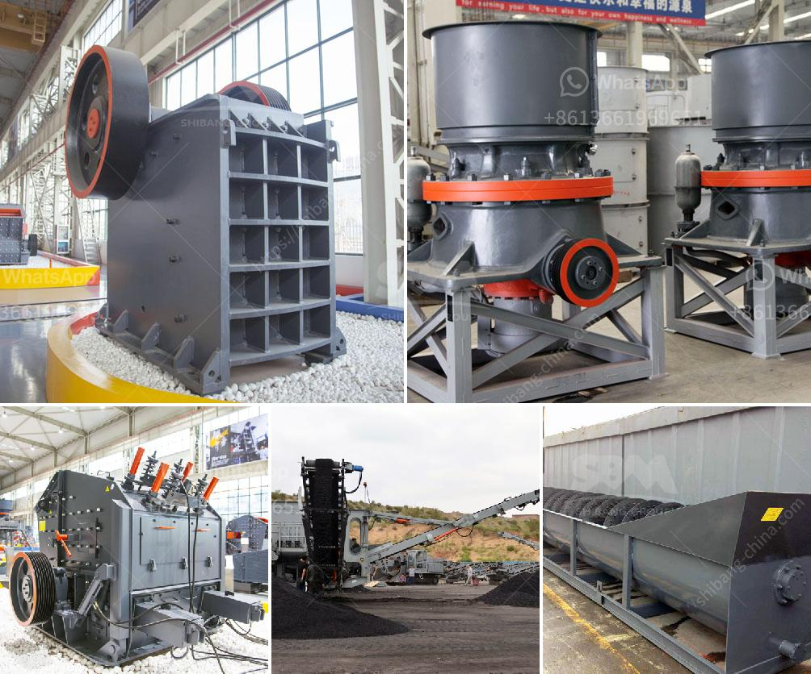

<h3>quartz stone crushing machine for stone industries</h3>
Quartz stone crushing machine for stone industries is the latest technology developed by machinery. It consists of feeding machine, sand maker, vibrating screen, and belt conveyor. In addition, the river stone crushing process is divided into primary crushing and secondary crushing.

Quartz stone is one of the mineral resources and has a very wide range of applications. With the development of modern industry, quartz stone has become more and more popular due to its excellent properties. It has become a new type of modern building material, widely used in various industries such as construction, road construction, metallurgy, and chemical industry.

The quartz stone crushing machine provided by machinery has high production efficiency and low operating cost. The finished product has uniform size and good particle shape. It meets the requirements of the national high-speed material standard, and has the characteristics of reliable performance, reasonable design, and easy operation.

The quartz stone crushing machine is suitable for crushing and shaping soft or medium-hard or extremely hard materials. It is widely used in various ore, cement, refractory materials, bauxite clinker, emery, glass raw materials, machine-made building stones, and gold slag. The quartz stone crushing machine has the functions of fine crushing and coarse grinding. The finished product has uniform particle size and excellent particle shape, which is conducive to the high-quality production of quartz stone.

The quartz stone crushing machine is an ideal crushing equipment for quartz stone. It has the advantages of simple structure, easy operation, high production efficiency, low energy consumption, etc. It is widely used in stone crushing in various industries such as mining, metallurgy, building materials, highways, railways, water conservancy, and chemical industry.

In conclusion, the quartz stone crushing machine is a reliable and efficient crushing equipment. It plays an important role in the quartz stone crushing process and is widely used in various industries. With the continuous improvement of technology, the quartz stone crushing machine will have more advanced technical performance and better market development prospects.
<h3>Contact us</h3><ul><li><strong>Whatsapp:&nbsp;<a href="https://wa.me/8613661969651">+8613661969651</a></strong></li><li><a href="https://swt.shibang-china.com/?git&amp;zhl&amp;quartz stone crushing machine for stone industries"><strong>Online Service(chat now)</strong></a></li></ul><h3>Related</h3><ul><li><a href='mobile crusher price list.md'>mobile crusher price list</a></li><li><a href='quotation for impact crusher.md'>quotation for impact crusher</a></li><li><a href='impact crusher hammer mill.md'>impact crusher hammer mill</a></li><li><a href='screening plant philippines.md'>screening plant philippines</a></li><li><a href='coal crushing machine.md'>coal crushing machine</a></li></ul>