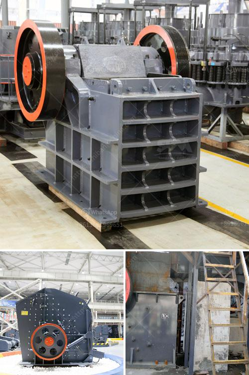

<h3>quartz stone crushing plant</h3>
Quartz has been used for thousands of years in various applications due to its impressive durability, availability, and aesthetic appeal. One of the most common uses of quartz is in the construction of residential and commercial buildings. Quartz stone crushing plants are essential in the construction industry, as they produce high-quality aggregates for use in various construction applications.

A quartz stone crushing plant takes quartz as the primary material, which is widely used in the manufacturing of several construction materials, such as glass, ceramics, and even electronic devices. It is a common raw material in the sand and aggregate industry. In the quartz stone crushing plant, crusher machines are used to crush these raw materials into small pieces for further size reduction.

The quartz stone crushing plant consists of a vibrating feeder, jaw crusher, impact crusher, vibrating screen, belt conveyor, and centralized electric control system. The recommended production capacity is 50-800t/h, depending on the size and hardness of the quartz stone.

The primary jaw crusher is generally used to crush larger size raw materials into smaller size particles. It features simple structure, high crushing ratio, and reliable performance. The impact crusher, on the other hand, produces cubically shaped end products, allowing for a more even distribution of the aggregate.

The vibrating screen separates the crushed materials into different sizes according to their final application requirements. The qualified materials are then transported to the finished product storage bins through the belt conveyor system.

In conclusion, a quartz stone crushing plant is an essential investment for the construction sector. With the continuous growth of infrastructure projects and the increasing demand for aggregate materials, quartz stone crushing plants provide the necessary aggregates to ensure the smooth progress of construction projects worldwide. Whether it is used in the production of glass, ceramics, or electronic devices, the high-quality aggregates produced by quartz stone crushing plants play a crucial role in various industries.
<h3>Contact us</h3><ul><li><strong>Whatsapp:&nbsp;<a href="https://wa.me/8613661969651">+8613661969651</a></strong></li><li><a href="https://swt.shibang-china.com/?git&amp;zhl&amp;quartz stone crushing plant"><strong>Online Service(chat now)</strong></a></li></ul><h3>Related</h3><ul><li><a href='list of cement plant in india.md'>list of cement plant in india</a></li><li><a href='ball mill catalogue.md'>ball mill catalogue</a></li><li><a href='mobile stone crusher south africa.md'>mobile stone crusher south africa</a></li><li><a href='raymond mill manufacturer.md'>raymond mill manufacturer</a></li><li><a href='stone crusher machines.md'>stone crusher machines</a></li></ul>