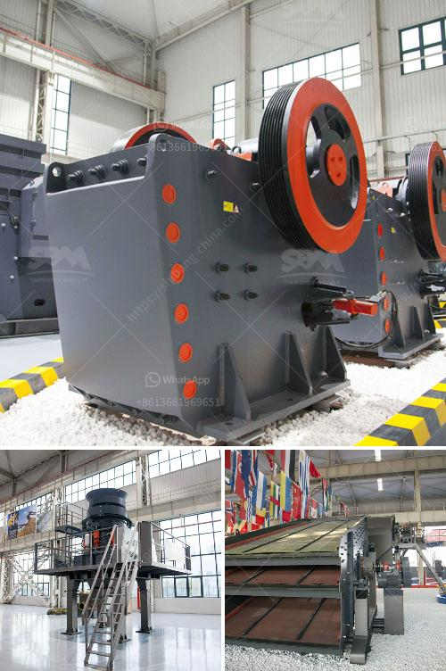

<h3>quartz stone heating machine for sale</h3>
Quartz stone heating machines are becoming increasingly popular in the stone industry due to their efficiency, durability, and versatility. These machines are designed to heat quartz slabs and transform them into high-quality finished products, making them a valuable asset for manufacturers and fabricators. With the rising demand for quartz stone products, the availability of quartz stone heating machines for sale is a major boost for businesses in this sector.

One of the key advantages of quartz stone heating machines is their exceptional heating capabilities. These machines utilize advanced heating technology to rapidly heat quartz slabs to the desired temperature. This ensures that the slabs are evenly heated throughout, allowing for precise processing and eliminating any inconsistencies in the final product. With the ability to reach temperatures up to 1000 degrees Celsius, these machines can handle a wide range of quartz stone thicknesses and sizes.

Durability is another important aspect that sets quartz stone heating machines apart. These machines are built with heavy-duty materials and components, making them highly resistant to wear and tear. This ensures longevity and reduces the need for frequent repairs or replacements, resulting in significant cost savings for manufacturers and fabricators. Additionally, the robust construction of these machines also guarantees the safety of operators and minimizes the risk of accidents in the workplace.

The versatility of quartz stone heating machines is another reason for their popularity. These machines are designed to accommodate various shapes and sizes of quartz slabs, providing flexibility in production processes. Whether it's for kitchen countertops, bathroom vanities, or flooring tiles, quartz stone heating machines can handle different applications and produce consistent results. Moreover, these machines can be easily adjusted to achieve different heating temperatures and processing times, allowing for customized production based on specific project requirements.

When looking for quartz stone heating machines for sale, it's important to consider certain factors. Firstly, the reputation and reliability of the manufacturer should be thoroughly researched. A reputable manufacturer will provide machines that meet industry standards and offer excellent after-sales support. Additionally, the features and specifications of the machine, such as heating capacity, energy efficiency, and control systems, should align with the specific requirements of the business.

Investing in a quartz stone heating machine can greatly enhance the productivity and profitability of a stone fabrication business. These machines offer efficient heating capabilities, durability, and versatility, resulting in high-quality finished products. By carefully selecting a reliable manufacturer and considering the specific needs of the business, manufacturers and fabricators can find the perfect quartz stone heating machine for their operations. With the growing demand for quartz stone products, having a reliable heating machine is essential for staying competitive in the market.
<h3>Contact us</h3><ul><li><strong>Whatsapp:&nbsp;<a href="https://wa.me/8613661969651">+8613661969651</a></strong></li><li><a href="https://swt.shibang-china.com/?git&amp;zhl&amp;quartz stone heating machine for sale"><strong>Online Service(chat now)</strong></a></li></ul><h3>Related</h3><ul><li><a href='iron ore concentrate prices.md'>iron ore concentrate prices</a></li><li><a href='stone aggregate crusher.md'>stone aggregate crusher</a></li><li><a href='vibration grinding equipment.md'>vibration grinding equipment</a></li><li><a href='costruire une machine pour broyer des briques.md'>costruire une machine pour broyer des briques</a></li><li><a href='the cost of stone crusher in pakistan.md'>the cost of stone crusher in pakistan</a></li></ul>