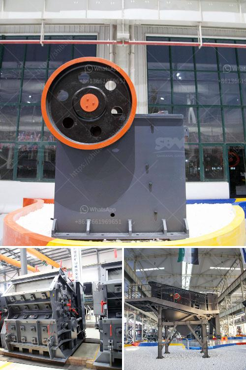

<h3>quartz stone lining machinery</h3>
Quartz stone has become increasingly popular in the construction industry due to its durability, beauty, and versatility. As a result, the demand for quartz stone lining machinery has also been on the rise. This machinery is essential for efficiently and accurately producing quartz stone lining, which is used for various applications such as countertops, flooring, and wall cladding.

One of the key benefits of using quartz stone lining machinery is its ability to automate the production process. This saves time and labor costs, as well as ensures consistency and precision in the final products. The machinery is equipped with advanced technology that allows for a high level of customization, allowing manufacturers to produce quartz stone linings in different sizes, shapes, and finishes to meet the unique requirements of each project.

Quartz stone lining machinery consists of several components, including cutting, grinding, and polishing machines. The cutting machine is responsible for shaping the quartz slabs into the desired dimensions, while the grinding machine smoothens the edges and makes them uniform. The polishing machine is used to give the quartz stone a glossy finish and enhance its overall appearance.

In addition to efficiency and customization, quartz stone lining machinery also offers environmental benefits. The machines are designed to minimize waste and optimize material usage. This not only reduces the environmental impact but also contributes to cost savings for manufacturers. Furthermore, quartz stone is an eco-friendly material itself, as it is made from natural quartz crystals and does not emit harmful substances during its lifespan.

To conclude, quartz stone lining machinery plays a crucial role in the production of high-quality quartz stone linings. Its automated and customizable features enable manufacturers to meet the diverse needs of the construction industry efficiently. Moreover, the environmental advantages associated with this machinery make it an attractive choice for sustainable building practices. With the continuous advancements in technology, we can only expect the quartz stone lining machinery to become even more sophisticated and efficient in the future.
<h3>Contact us</h3><ul><li><strong>Whatsapp:&nbsp;<a href="https://wa.me/8613661969651">+8613661969651</a></strong></li><li><a href="https://swt.shibang-china.com/?git&amp;zhl&amp;quartz stone lining machinery"><strong>Online Service(chat now)</strong></a></li></ul><h3>Related</h3><ul><li><a href='trommel screen sale australia.md'>trommel screen sale australia</a></li><li><a href='100 tph stone crusher.md'>100 tph stone crusher</a></li><li><a href='pulverizer limestone crusher manufacturer in india.md'>pulverizer limestone crusher manufacturer in india</a></li><li><a href='ball mill for sale uk.md'>ball mill for sale uk</a></li><li><a href='ball mill for size reduction.md'>ball mill for size reduction</a></li></ul>