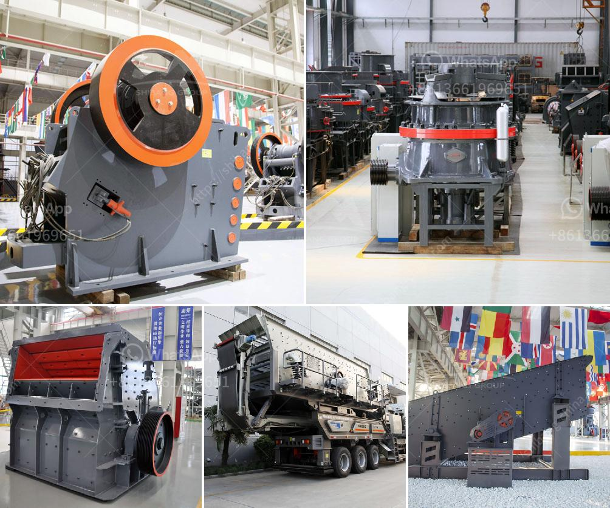

<h3>quartz stone powder manufacturing plant in india</h3>
Quartz is a mineral that is abundant on Earth and is used in various industries for its durability, versatility, and beauty. One of its most popular applications is the production of quartz stone powder, which is widely used in the construction, ceramics, and chemical industries. In India, there are several manufacturing plants dedicated to producing quartz stone powder to cater to the growing demand both domestically and internationally.

The quartz stone powder manufacturing plant in India is a project that has been on the rise for the past few years, with the construction industry booming and the demand for quartz stone powder on the rise. The plant, which was installed in 2008, has been meeting the ever-growing needs of these sectors with its high-quality and pure quartz powder.

As the plant is located near one of the largest quartz deposits in India, the quartz powder manufacturing industry in India is projected to witness a significant growth rate in the coming years. With the abundant availability of quartz, there is also a great scope for setting up more manufacturing plants in different parts of the country to meet the increasing demand.

The manufacturing process of quartz stone powder begins with the crushing of large-sized quartz stones into smaller particles. The stones are then sent to a ball mill, where they are ground into fine powder. The powdered quartz is then mixed with binders and pigments to give it the desired texture and color. After that, the mixture is poured into molds and subjected to high pressure and temperature to form solid slabs or blocks. These slabs are then polished to achieve a smooth and shiny finish.

The quartz stone powder manufacturing plant in India has technically advanced machinery and equipment that ensure smooth operations, reliability, and timely production of quartz stone powder. The manufacturing process is environment-friendly and does not emit any toxic gases. The plant also adheres to all the safety and health regulations and is constantly working towards reducing energy consumption and waste generation.

The quartz stone powder produced by the manufacturing plant is of high quality and has a wide range of applications. It is used in the construction industry for making countertops, flooring, and wall claddings. The quartz powder is highly resistant to heat, stains, and scratches, making it an ideal choice for kitchen and bathroom countertops. It is also used in the ceramics industry for making tiles, sanitary ware, and other decorative items. The chemical industry uses quartz powder as a raw material for producing glass, paints, and coatings.

To conclude, the quartz stone powder manufacturing plant in India is a profitable venture for aspiring entrepreneurs. It provides opportunities for business expansion, generates employment, and contributes to the growth of the construction, ceramics, and chemical industries. With the increasing demand for quartz stone powder, setting up more manufacturing plants across India can capitalize on this opportunity and help meet the growing needs of the market.
<h3>Contact us</h3><ul><li><strong>Whatsapp:&nbsp;<a href="https://wa.me/8613661969651">+8613661969651</a></strong></li><li><a href="https://swt.shibang-china.com/?git&amp;zhl&amp;quartz stone powder manufacturing plant in india"><strong>Online Service(chat now)</strong></a></li></ul><h3>Related</h3><ul><li><a href='diatomite processing plant.md'>diatomite processing plant</a></li><li><a href='ball mill conique occasion allemand.md'>ball mill conique occasion allemand</a></li><li><a href='new crushing machine in south africa.md'>new crushing machine in south africa</a></li><li><a href='screening plant philippines.md'>screening plant philippines</a></li><li><a href='price of stone crusher capacitytons an hour.md'>price of stone crusher capacitytons an hour</a></li></ul>