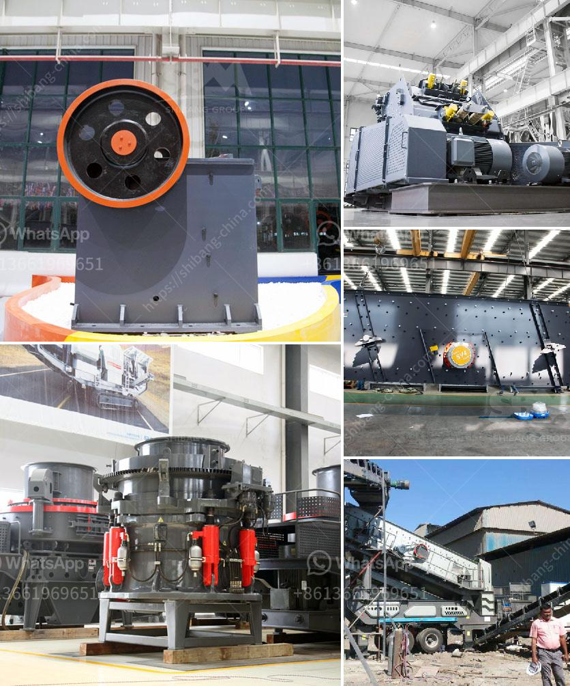

<h3>quotation for impact crusher</h3>
The construction industry is experiencing rapid growth, with projects popping up in every part of the world. From residential buildings to commercial complexes and infrastructure development, the demand for high-quality construction materials is skyrocketing. One such crucial material is crushed stone, which is widely used for various applications in construction.

To meet the increasing demand for crushed stone, manufacturers have introduced efficient and innovative equipment like impact crushers. These crushers are designed to break down large rocks into smaller, more manageable sizes, making them suitable for use in construction projects. They are known for their ability to produce consistent and high-quality aggregates, ensuring a better end product.

Considering the significance of impact crushers in the construction industry, it is essential to source them from reliable manufacturers who offer competitive prices. To facilitate the process of procurement, manufacturers provide quotations to potential buyers. These quotations include detailed information about the impact crusher's specifications, features, and pricing.

The quotation for an impact crusher typically includes details about its capacity, feed size, rotor diameter, power supply, weight, and dimensions. This information helps buyers understand the machine's capabilities and suitability for their specific construction projects. Additionally, the quotation may also mention any optional features or customizations available, allowing buyers to choose the configuration that best fits their requirements.

Price is another crucial factor covered in the quotation. Manufacturers strive to offer competitive prices to attract potential buyers. However, it is essential to strike a balance between cost and quality. While opting for the cheapest option may seem lucrative, compromised quality can lead to subpar results and increased maintenance costs in the long run.

Moreover, reputable manufacturers often provide comprehensive after-sales support, including technical assistance, spare parts availability, and warranty coverage. These aspects should also be considered while analyzing the quotation.

In conclusion, impact crushers play a vital role in the construction industry by efficiently producing high-quality crushed stone. To facilitate the procurement process, manufacturers provide detailed quotations, listing the machine's specifications, features, and pricing. Buyers should carefully analyze these quotations, considering factors like capacity, price, optional features, and after-sales support, to make an informed decision. By choosing the right impact crusher, construction professionals can enhance productivity and ensure the success of their projects in the competitive construction industry.
<h3>Contact us</h3><ul><li><strong>Whatsapp:&nbsp;<a href="https://wa.me/8613661969651">+8613661969651</a></strong></li><li><a href="https://swt.shibang-china.com/?git&amp;zhl&amp;quotation for impact crusher"><strong>Online Service(chat now)</strong></a></li></ul><h3>Related</h3><ul><li><a href='vertical vertical grinding machine.md'>vertical vertical grinding machine</a></li><li><a href='coal crusher machine china.md'>coal crusher machine china</a></li><li><a href='cement lime crusher.md'>cement lime crusher</a></li><li><a href='conveyor belt for crusher china.md'>conveyor belt for crusher china</a></li><li><a href='iron ore crushers.md'>iron ore crushers</a></li></ul>