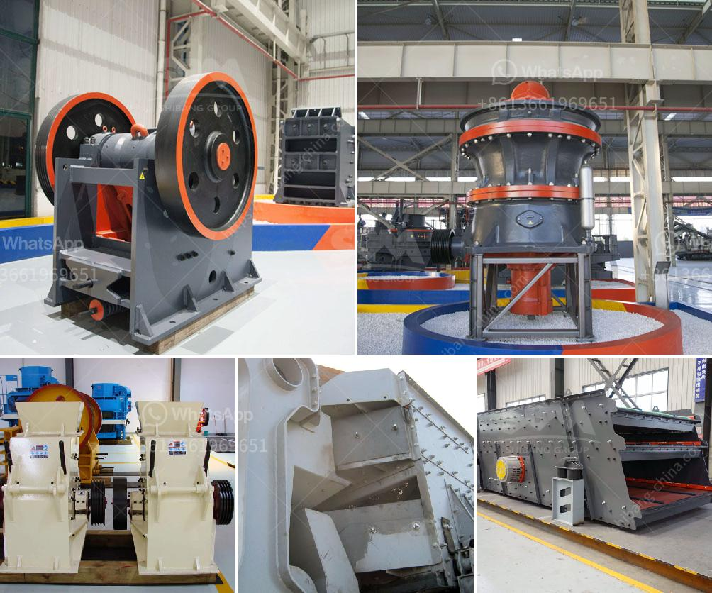

<h3>quotation for jaw crusher</h3>
When it comes to construction projects, efficiency is key. The ability to break down larger chunks of rock or concrete into smaller, more manageable pieces is crucial to a smooth workflow and successful completion of any project. This is where a jaw crusher comes into play.

A jaw crusher is a powerful machine that is used for crushing a variety of rocks and abrasive materials such as recycled concrete, granite, or other types of materials into smaller sizes for further processing. The jaw crusher is capable of breaking down even the hardest of materials, making it a valuable asset to any construction site.

If you are in the market for a jaw crusher, it is essential to obtain a quotation that outlines the cost and specifications of the machine. This will allow you to compare different options and find the best fit for your specific needs.

When requesting a quotation for a jaw crusher, there are several factors to consider. First and foremost, you should provide details about the type of material you will be crushing and the desired output size. This information will help the supplier recommend the most suitable jaw crusher model for your application.

Additionally, it is crucial to inquire about the capacity of the jaw crusher. This refers to the maximum amount of material the crusher can process per hour. Depending on the scale of your project, you may require a higher capacity jaw crusher to ensure productivity and efficiency.

Next, it is important to consider the power source required by the jaw crusher. Some crushers operate on electricity, while others may require diesel fuel or have the option for both. Evaluating your power source options will help determine the best fit for your project's needs.

Furthermore, it is essential to inquire about the warranty and after-sales support offered by the supplier. A crusher is a long-term investment, and having proper backup and support in case of any issues is crucial to ensure uninterrupted operation.

In conclusion, a jaw crusher is a valuable tool for construction projects that require efficient breaking down of materials. When obtaining a quotation for a jaw crusher, it is important to consider factors such as material type, desired output size, capacity, power source, warranty, and after-sales support. By obtaining multiple quotations and comparing different options, you can find the jaw crusher that best fits your project's requirements and budget.
<h3>Contact us</h3><ul><li><strong>Whatsapp:&nbsp;<a href="https://wa.me/8613661969651">+8613661969651</a></strong></li><li><a href="https://swt.shibang-china.com/?git&amp;zhl&amp;quotation for jaw crusher"><strong>Online Service(chat now)</strong></a></li></ul><h3>Related</h3><ul><li><a href='coal pulverizer manufacturer.md'>coal pulverizer manufacturer</a></li><li><a href='sell jaw crusher for turkey.md'>sell jaw crusher for turkey</a></li><li><a href='prices of conveyor belts for mining.md'>prices of conveyor belts for mining</a></li><li><a href='used gypsum plant for sale europe.md'>used gypsum plant for sale europe</a></li><li><a href='sell stone crusher 2x4.md'>sell stone crusher 2x4</a></li></ul>