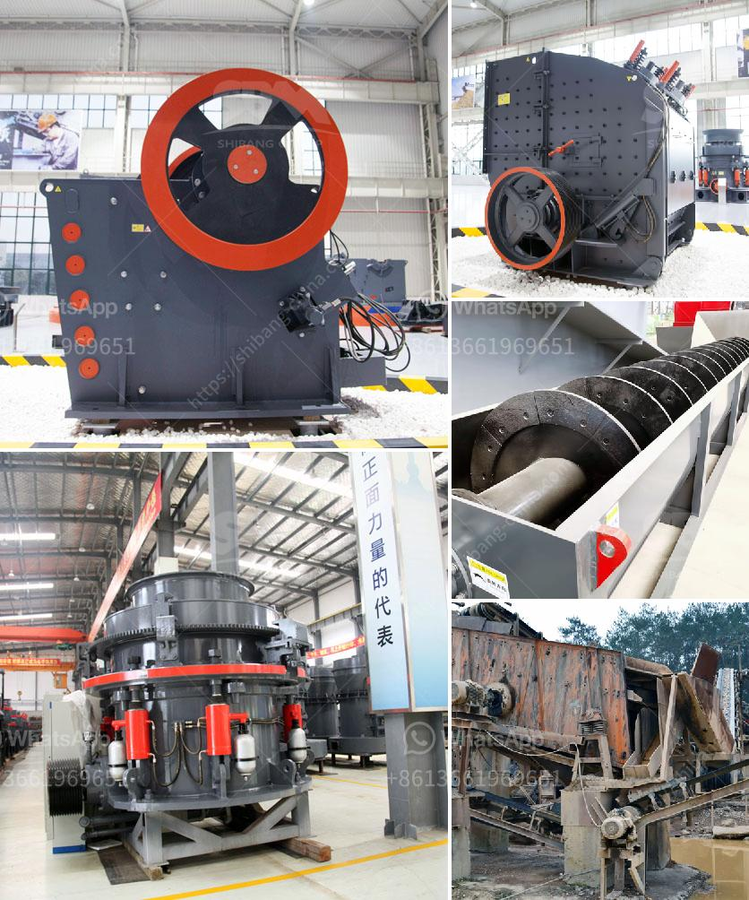

<h3>raymond mill bentonite</h3>
Raymond Mill is a specialized piece of equipment used primarily for grinding various non-flammable and non-explosive materials of hardness less than 7 and humidity below 6%. Bentonite is a material that fits the bill perfectly. It's a clay-like mineral that is obtained by mining and is used in various industrial applications to improve product performance.

Bentonite has unique properties that make it a popular choice in industries such as construction, drilling, and agriculture. Its ability to absorb large amounts of water, create a gel-like substance, and provide lubrication and viscosity to drilling fluids or concrete mixtures sets it apart from other minerals. However, to ensure the effective utilization of bentonite, the grinding process is critical, which is where Raymond Mill comes in.

Raymond Mill, with its advanced technology and years of experience in the industry, has been instrumental in the efficient grinding of bentonite. Its low energy consumption, low investment cost, and high grinding efficiency make it the ideal choice for grinding bentonite. Here's why:

Firstly, Raymond Mill adopts a vertical structure with a small footprint. This compact design enables it to be easily installed in existing production lines without major modifications. The vertical structure also helps in reducing the overall power consumption of the mill, making it an energy-efficient option.

Secondly, Raymond Mill employs a unique grinding roller device and grinding ring design. The grinding roller and grinding ring are made of wear-resistant materials, extending their service life significantly. The special design of the grinding roller and grinding ring also ensures a more uniform and efficient grinding process. This results in finer particle size distribution and improved product quality.

Thirdly, Raymond Mill is equipped with a high-efficiency and low-resistance centrifugal induced draft fan. This fan exhausts the powder and ensures a clean and dust-free working environment. The fan also helps in maintaining a stable air pressure inside the mill, preventing the powder from escaping and minimizing material loss during the grinding process.

Furthermore, Raymond Mill has a strong adaptability to different materials. Whether the bentonite is relatively hard or soft, Raymond Mill can handle it with ease. Its adjustable grinding pressure and rotation speed cater to different material characteristics, providing a tailored and precise grinding solution.

In conclusion, Raymond Mill is a reliable and efficient solution for grinding bentonite. Its advanced technology, low energy consumption, and high grinding efficiency make it a valuable asset in various industries. Whether it's the construction, drilling, or agricultural sector, Raymond Mill ensures the effective utilization of bentonite, enhancing product performance and improving overall productivity.

So, if you're looking for a grinding solution that guarantees high quality and efficiency, Raymond Mill is the way to go. Its performance and reliability have made it a trusted choice among professionals worldwide. With Raymond Mill, bentonite grinding is no longer a challenging task but a straightforward and efficient process.
<h3>Contact us</h3><ul><li><strong>Whatsapp:&nbsp;<a href="https://wa.me/8613661969651">+8613661969651</a></strong></li><li><a href="https://swt.shibang-china.com/?git&amp;zhl&amp;raymond mill bentonite"><strong>Online Service(chat now)</strong></a></li></ul><h3>Related</h3><ul><li><a href='marble milling machine.md'>marble milling machine</a></li><li><a href='rock processing plant equipment.md'>rock processing plant equipment</a></li><li><a href='sand making machine indonesia.md'>sand making machine indonesia</a></li><li><a href='mining process of limestone.md'>mining process of limestone</a></li><li><a href='crusher dealers in kenya.md'>crusher dealers in kenya</a></li></ul>