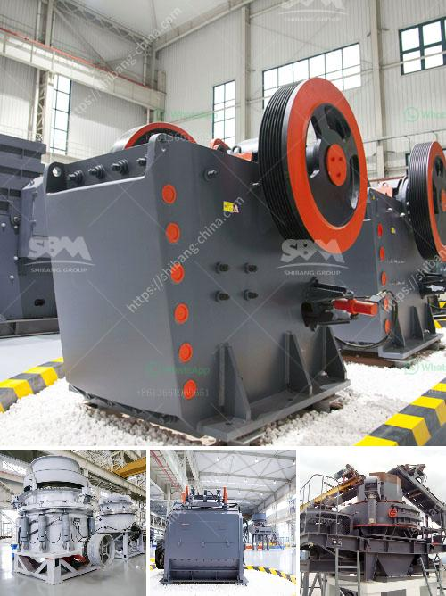

<h3>raymond mill manufacturer</h3>
When it comes to purchasing industrial equipment, one brand that never fails to impress is Raymond. With a history spanning over 100 years, Raymond is known for its reliable and efficient machinery, making it a top choice for businesses across various industries. As a leading manufacturer of Raymond mills, they have continuously perfected their products, earning the trust and loyalty of their customers.

One of the key reasons why Raymond mills have become so popular is their advanced technology and innovative design. Raymond mills are designed to grind materials into extremely fine powders, ensuring high efficiency and lower energy consumption. The unique airflow system and advanced classifier allow for precise control over the particle size distribution, resulting in consistent and uniform end products.

Another factor that sets Raymond apart from its competitors is its strong focus on quality control. As a reputable manufacturer, Raymond invests heavily in research and development, constantly seeking ways to improve their products. Each Raymond mill undergoes rigorous testing to ensure it meets the highest standards of performance and durability. This commitment to quality has earned Raymond a reputation for producing machinery that lasts for many years with minimal maintenance.

In addition to their superior quality, Raymond mills are also known for their versatility. They can be used to grind a wide range of materials, including limestone, marble, talc, dolomite, and gypsum, among others. This makes them ideal for applications in various industries, such as mining, construction, chemical engineering, and metallurgy. Customers can rely on Raymond mills to effectively process different materials and meet their specific production requirements.

Raymond is also recognized for its outstanding customer support. Their team of experts provides comprehensive assistance, from selecting the right mill for a particular application to providing prompt technical support and spare parts. This dedication to customer service ensures that businesses can rely on Raymond to keep their operations running smoothly and efficiently.

Furthermore, Raymond mills are known for their cost-effectiveness. Despite their advanced technology and unmatched performance, Raymond mills are competitively priced, offering businesses a great value for their investment. Their efficient design also contributes to lower energy consumption, helping companies save on operational costs in the long run.

In conclusion, Raymond is a trusted manufacturer of industrial equipment, particularly their high-quality Raymond mills. With their advanced technology, innovative design, and rigorous quality control, Raymond mills have become a top choice for businesses across various industries. The versatility, reliability, and cost-effectiveness of Raymond mills make them a worthy investment for any company looking to enhance their production capabilities. With Raymond, you can be assured of machinery that delivers exceptional performance, durability, and customer satisfaction.
<h3>Contact us</h3><ul><li><strong>Whatsapp:&nbsp;<a href="https://wa.me/8613661969651">+8613661969651</a></strong></li><li><a href="https://swt.shibang-china.com/?git&amp;zhl&amp;raymond mill manufacturer"><strong>Online Service(chat now)</strong></a></li></ul><h3>Related</h3><ul><li><a href='nigeria crusher plant 200 tph.md'>nigeria crusher plant 200 tph</a></li><li><a href='impact crushers turkey.md'>impact crushers turkey</a></li><li><a href='coconut shell powder machine project report.md'>coconut shell powder machine project report</a></li><li><a href='ball mills for mica powder.md'>ball mills for mica powder</a></li><li><a href='crushing machine manufacturer.md'>crushing machine manufacturer</a></li></ul>