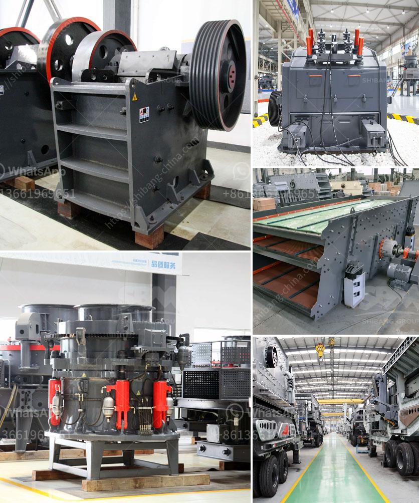

<h3>raymond used mill for sale</h3>
Are you in the market for a high-quality, reliable mill at an affordable price? Look no further than Raymond used mill for sale. Raymond is a widely recognized brand known for its cutting-edge technology and superior performance in the milling industry. With a Raymond used mill, you can expect exceptional results without breaking the bank.

A Raymond used mill offers numerous advantages. First and foremost, it is a cost-effective solution for your milling needs. Purchasing a used mill can save you a significant amount of money compared to buying a brand-new one, yet you still get the same performance and efficiency. This makes it an ideal choice for those on a limited budget or looking to maximize their return on investment.

Furthermore, a Raymond used mill comes with the assurance of quality. Raymond has a longstanding reputation for manufacturing durable, long-lasting machinery. By purchasing a pre-owned mill from this trusted brand, you can have peace of mind knowing that you are investing in a reliable and robust piece of equipment.

Another advantage of opting for a used Raymond mill is the availability of various models and specifications. Whether you need a high-capacity mill for heavy-duty industrial applications or a smaller one for light operations, there is a wide range of options to choose from. This allows you to select a mill that perfectly matches your specific requirements and fits seamlessly into your existing setup.

It is worth noting that a Raymond used mill undergoes a rigorous evaluation process before it is put up for sale. This includes thorough inspection, testing, and refurbishment by qualified technicians, ensuring that the mill is in optimal working condition. This meticulous attention to detail guarantees that you receive a well-maintained machine ready to perform at its best.

In conclusion, if you are in search of a cost-effective milling solution without compromising on quality, consider a Raymond used mill. With its affordability, reliability, variety, and assurance of performance, it is a steal deal that will exceed your expectations. Don't miss out on this opportunity to acquire a top-notch mill at a fraction of the cost.
<h3>Contact us</h3><ul><li><strong>Whatsapp:&nbsp;<a href="https://wa.me/8613661969651">+8613661969651</a></strong></li><li><a href="https://swt.shibang-china.com/?git&amp;zhl&amp;raymond used mill for sale"><strong>Online Service(chat now)</strong></a></li></ul><h3>Related</h3><ul><li><a href='cost of set up mini cement plant in india.md'>cost of set up mini cement plant in india</a></li><li><a href='mobile jaw crusher dealers south africa.md'>mobile jaw crusher dealers south africa</a></li><li><a href='malaysia hammer mills.md'>malaysia hammer mills</a></li><li><a href='mobile crusher hire kenya.md'>mobile crusher hire kenya</a></li><li><a href='the cost of stone crusher in pakistan.md'>the cost of stone crusher in pakistan</a></li></ul>