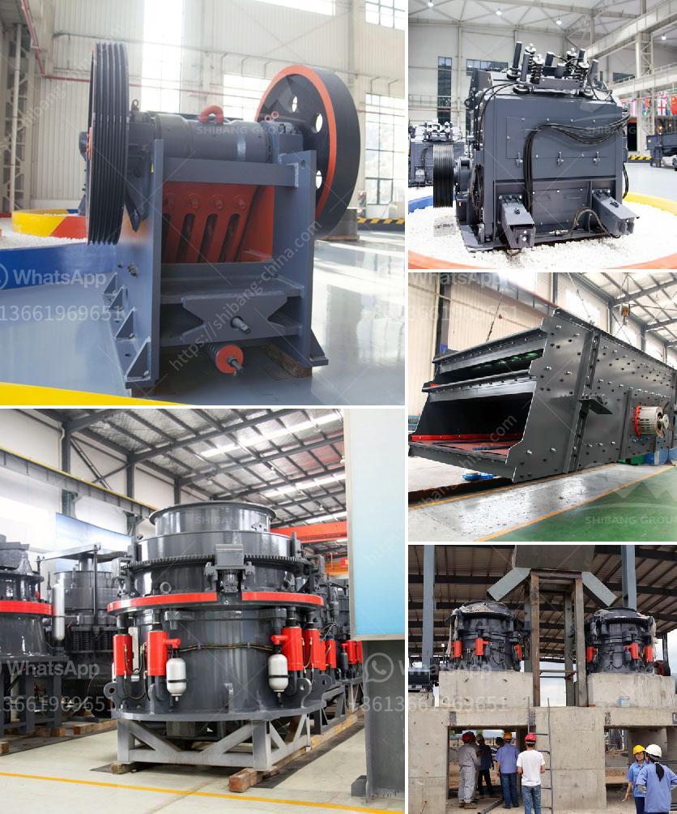

<h3>recycled glass price per tonne in durban</h3>
The recycling industry has gained considerable momentum across the globe in recent years, and South Africa is no exception. As concerns over environmental sustainability continue to rise, more and more people are recognizing the importance of recycling various materials, including glass. Durban, one of South Africa's vibrant coastal cities, has experienced a surge in glass recycling activities. In this article, we will explore the price per tonne of recycled glass in Durban.

Glass recycling has significant benefits for both the environment and the economy. By recycling glass, we reduce the demand for raw materials, lower energy consumption during production, and minimize the amount of waste sent to landfills. Additionally, recycling glass can generate revenue through the sale of recycled materials. Glass recycling plants in Durban have been playing a crucial role in this process.

The price of recycled glass per tonne in Durban can vary depending on various factors such as the quality of the glass, its color, and the demand in the market. On average, the price ranges from R250 to R600 per tonne. However, it is important to note that glass containers have different values compared to other types of glass, such as windowpanes or windshields, due to their varying composition. While glass containers are the most commonly recycled glass, the price per tonne is generally higher compared to other types.

The demand for recycled glass in Durban is influenced by several factors. Firstly, the construction and architecture sectors play a significant role in driving the market demand for recycled glass. As the use of sustainable and eco-friendly materials gains popularity, construction companies in Durban are increasingly incorporating recycled glass into their projects. This demand for recycled glass has a positive impact on the price per tonne in Durban.

Secondly, the beverage industry contributes to the demand for recycled glass. Many beverage companies in Durban have realized the environmental benefits of using recycled glass containers for their products. By utilizing recycled glass bottles, these companies enhance their sustainability practices and contribute to reducing carbon emissions. Hence, the demand for recycled glass containers increases, affecting the price per tonne.

Furthermore, government policies and regulations also play a significant role in shaping the price per tonne of recycled glass in Durban. The South African government has been proactive in promoting recycling by implementing policies that support the recycling industry. Incentives and subsidies for recycling companies often encourage higher recycling rates, subsequently affecting the supply and demand dynamics of recycled glass.

It is also crucial to mention that the price per tonne of recycled glass can be influenced by global market trends, as recycled materials are part of the global supply chain. Changes in international market demands, tariffs, and transportation costs can impact the price of recycled glass in Durban.

Overall, the price of recycled glass per tonne in Durban reflects the growing recognition of the benefits of recycling and the increasing demand for sustainable materials. As the recycling industry continues to evolve and gain momentum in Durban, the price per tonne of recycled glass is likely to fluctuate. However, with ongoing efforts to promote and incentivize recycling, the long-term outlook for the recycling industry appears promising in terms of both environmental sustainability and economic gains.
<h3>Contact us</h3><ul><li><strong>Whatsapp:&nbsp;<a href="https://wa.me/8613661969651">+8613661969651</a></strong></li><li><a href="https://swt.shibang-china.com/?git&amp;zhl&amp;recycled glass price per tonne in durban"><strong>Online Service(chat now)</strong></a></li></ul><h3>Related</h3><ul><li><a href='cone crushers manufacturer.md'>cone crushers manufacturer</a></li><li><a href='uk quarry crusher machinery manufacturers.md'>uk quarry crusher machinery manufacturers</a></li><li><a href='working machine of a stone crusher.md'>working machine of a stone crusher</a></li><li><a href='stone crushing machines uk.md'>stone crushing machines uk</a></li><li><a href='pf impact crusher for stone breaking machine for sale.md'>pf impact crusher for stone breaking machine for sale</a></li></ul>