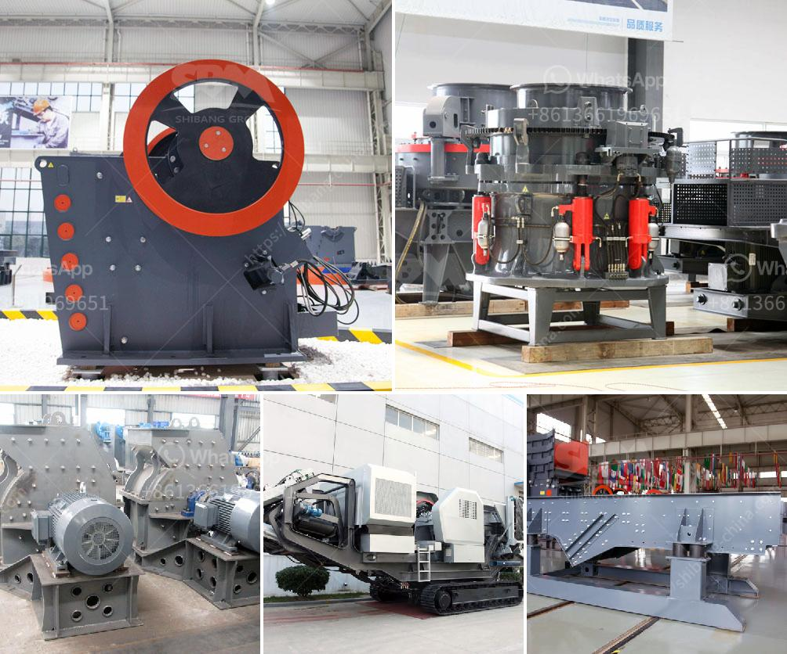

<h3>recycling of construction materials</h3>
Construction projects result in massive quantities of waste materials such as concrete, bricks, wood, metals, and plastics. However, with the growing global concern about environmental sustainability and the need to reduce carbon footprint, there has been a surge in the recycling of construction materials. This practice not only helps in reducing the impact of construction waste on the environment but also offers various economic and societal benefits.

One of the main advantages of recycling construction materials is the conservation of natural resources. By reusing and repurposing materials, the demand for virgin resources is reduced, minimizing the need for extraction activities. This leads to the preservation of valuable resources like timber, stone, and minerals. Additionally, recycling reduces the energy required in the manufacturing process. For instance, recycling steel saves up to 75% of the energy that would be needed to produce new steel from raw materials.

Furthermore, the recycling of construction materials plays a significant role in waste reduction, diverting waste from already overflowing landfills. Landfills are not only eyesores but also emit harmful gases, contributing to air pollution and climate change. By recycling materials such as concrete and asphalt, which can be crushed and repurposed as aggregate for new construction projects, waste volumes are significantly reduced. This also helps in preventing the depletion of landfill space, which is a growing concern in many urban areas.

Another noteworthy benefit of recycling construction materials is the potential for cost savings both for project owners and contractors. Recycling materials can substantially lower project costs compared to purchasing new materials. For example, using reclaimed bricks instead of new ones can result in considerable savings. Contractors can also reduce the costs associated with waste disposal as recycling facilities often charge lower fees than landfill operators. Additionally, governments and municipalities may offer financial incentives for recycling initiatives, further reducing costs for construction companies.

In addition to environmental and economic benefits, recycling construction materials also improves societal well-being. By diverting waste from landfills and reducing construction-related pollution, recycling positively impacts public health. It lowers the risk of exposure to hazardous substances and minimizes the environmental degradation caused by waste disposal. Moreover, recycling construction materials often involves creating employment opportunities in specialized recycling facilities, contributing to the local economy and job creation.

However, despite the evident advantages, there are still challenges in widespread adoption of construction materials recycling. Lack of awareness and knowledge about recycling processes, regulations, and available facilities can hinder successful implementation. To overcome these barriers, public and private organizations need to invest in educational campaigns and provide clear guidelines and information to stakeholders in the construction industry.

In conclusion, the recycling of construction materials presents a sustainable approach to waste management in the construction sector. It conserves natural resources, reduces waste volumes, and offers cost savings to project owners and contractors. Furthermore, it benefits public health, local economies, and the environment. To maximize the benefits, it is crucial to promote awareness and provide necessary support for recycling initiatives. By adopting recycling practices, we can move towards a more sustainable and greener construction industry.
<h3>Contact us</h3><ul><li><strong>Whatsapp:&nbsp;<a href="https://wa.me/8613661969651">+8613661969651</a></strong></li><li><a href="https://swt.shibang-china.com/?git&amp;zhl&amp;recycling of construction materials"><strong>Online Service(chat now)</strong></a></li></ul><h3>Related</h3><ul><li><a href='puzzolana 200 tph cone crushers parts.md'>puzzolana 200 tph cone crushers parts</a></li><li><a href='price list of granite crusher.md'>price list of granite crusher</a></li><li><a href='vertical shaft crusher.md'>vertical shaft crusher</a></li><li><a href='stone quarry crusher equipment germany.md'>stone quarry crusher equipment germany</a></li><li><a href='beneficiation of iron ore suppliers.md'>beneficiation of iron ore suppliers</a></li></ul>