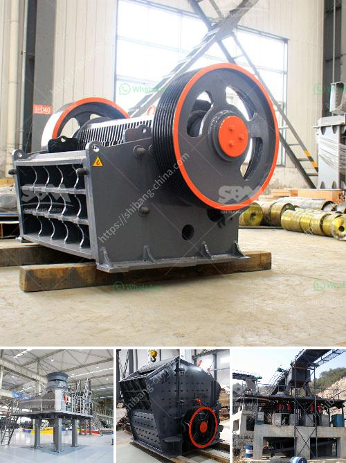

<h3>regulatory conveyor belts</h3>
In today's fast-paced and ever-changing world, industries are faced with the challenge of ensuring safety and quality while keeping up with regulatory standards. This is where regulatory conveyor belts play a crucial role. These belts help in implementing and enforcing regulations, ensuring that products and processes meet the required quality and safety standards.

Regulatory conveyor belts act as a seamless checkpoint mechanism, continuously monitoring and controlling the flow of products and materials throughout the manufacturing process. These belts are equipped with sensors, scanners, and other sophisticated technologies that enable real-time tracking and analysis of various parameters, including quality, safety, and compliance.

One of the key benefits of regulatory conveyor belts is their ability to automate the identification of non-compliant products or processes. By integrating artificial intelligence and machine learning algorithms, these belts can quickly analyze data and flag any inconsistencies. This automated process saves a significant amount of time and resources, particularly in industries where large volumes of products are produced and inspected regularly.

The utilization of regulatory conveyor belts also minimizes the risk of human error, leading to more accurate compliance monitoring and reporting. Unlike manual inspections, which are prone to biases and fatigue, these belts consistently apply regulatory standards without any deviations. Human intervention is still required for decision-making and problem-solving, but the conveyor belts provide the necessary data and guidance for efficient and effective compliance management.

Another advantage of regulatory conveyor belts is their ability to integrate with other quality management systems and regulatory agencies. Through the use of advanced communication technologies, these belts can exchange data, reports, and alerts with relevant stakeholders. This allows for immediate action, facilitating timely corrections and improvements in the production process.

Furthermore, regulatory conveyor belts contribute to the overall culture of quality and compliance within an organization. By constantly monitoring and enforcing regulatory standards, these belts instill a sense of responsibility and accountability among employees. Regular compliance checks also encourage continuous improvement and innovation, as companies strive to meet and exceed regulatory requirements.

It is important to note that regulatory conveyor belts are not limited to a specific industry or sector. They can be applied in various manufacturing and production environments, including food and beverage, pharmaceuticals, automotive, and electronics. Each industry has its unique set of regulations and quality standards, and these belts can be customized to suit specific requirements.

In conclusion, regulatory conveyor belts play a vital role in ensuring quality and safety in today's fast-paced industries. Their ability to automate compliance monitoring, minimize human error, integrate with other systems, and foster a culture of accountability makes them an indispensable tool. As technology continues to advance, these belts are likely to become even more sophisticated in their capabilities, enabling industries to meet and exceed regulatory standards while maintaining efficiency and productivity.
<h3>Contact us</h3><ul><li><strong>Whatsapp:&nbsp;<a href="https://wa.me/8613661969651">+8613661969651</a></strong></li><li><a href="https://swt.shibang-china.com/?git&amp;zhl&amp;regulatory conveyor belts"><strong>Online Service(chat now)</strong></a></li></ul><h3>Related</h3><ul><li><a href='gold plant for sale philippines.md'>gold plant for sale philippines</a></li><li><a href='price of stone crusher capacitytons an hour.md'>price of stone crusher capacitytons an hour</a></li><li><a href='coal crusher machine china.md'>coal crusher machine china</a></li><li><a href='stone crushers for sale in riyadh.md'>stone crushers for sale in riyadh</a></li><li><a href='crushing plant aggregate type.md'>crushing plant aggregate type</a></li></ul>