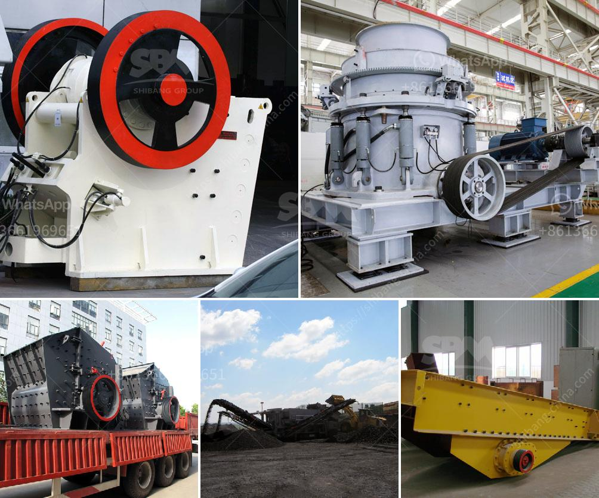

<h3>rental of crusher in malaysia</h3>
The rental of a crusher in Malaysia is an essential requirement for any construction or mining company looking to streamline processes and increase productivity. A crusher is essentially a machine designed to reduce large rocks into smaller rocks, gravel, or rock dust.

Crushers are commonly classified into three main types, namely jaw crusher, cone crusher, and impact crusher. However, other types of crushers like gyratory crushers and portable crushers are also available. These machines operate by applying compressive force to the materials, which breaks them down into smaller chunks.

Renting a crusher in Malaysia offers several benefits to construction and mining companies. These machines can help reduce handling and transportation costs, as well as improve efficiency by eliminating the need for material screening. Furthermore, they enable operators to process large quantities of material quickly and efficiently.

The rental of a crusher in Malaysia is good for crushing concrete, bricks, stones, and other hard materials. During the process of crushing, excess concrete, bricks, and stones can be recycled, which ultimately reduces the amount of construction waste in landfills. To achieve maximum efficiency, a crushing plant should be configured to break the material in the correct order, with the right equipment and settings in place.

A rental of a crusher in Malaysia is often a cost-effective way for companies to improve productivity and efficiency while reducing upfront costs. By renting a crusher, companies can save on transportation costs as they can take the rock to the crusher to be crushed instead of having to haul it out to a full-scale crusher.

With the increasing demand for crusher rental in Malaysia, there has been a surge in crushers' supply. Contract crushing and screening companies are struggling to find equipment to rent, and this is where the opportunity is for Malaysia to grab its market share in the market.

Malaysia's mining market is diverse, and there can be more than one size fits all solution when it comes to crusher rentals. One such opportunity is the rental of stone crushers from companies such as Telsmith and Finlay. These companies can deliver Malaysia's construction and mining companies high-quality crushers for rent and crushing services.

By using crushers, recycling companies can recycle inner waste instead of dumping them into the landfills. Besides, it reduces transportation costs as materials can be crushed on-site and the required aggregate can be reused. It is an excellent option for contractors in Malaysia who are looking to expand their business and increase productivity.

In conclusion, renting a crusher in Malaysia is an essential step towards achieving cost efficiency and productivity in construction and mining operations. By allowing operators to process materials on-site, companies can eliminate transportation costs and reduce waste. Furthermore, rental options ensure that companies have access to high-quality crushers without the hefty upfront investment.
<h3>Contact us</h3><ul><li><strong>Whatsapp:&nbsp;<a href="https://wa.me/8613661969651">+8613661969651</a></strong></li><li><a href="https://swt.shibang-china.com/?git&amp;zhl&amp;rental of crusher in malaysia"><strong>Online Service(chat now)</strong></a></li></ul><h3>Related</h3><ul><li><a href='conveyor belt price per meter.md'>conveyor belt price per meter</a></li><li><a href='manganese ore beneficiation plant china.md'>manganese ore beneficiation plant china</a></li><li><a href='used mini grinding plant india sale.md'>used mini grinding plant india sale</a></li><li><a href='pulverizer limestone crusher manufacturer in india.md'>pulverizer limestone crusher manufacturer in india</a></li><li><a href='rotary kiln design calculations.md'>rotary kiln design calculations</a></li></ul>