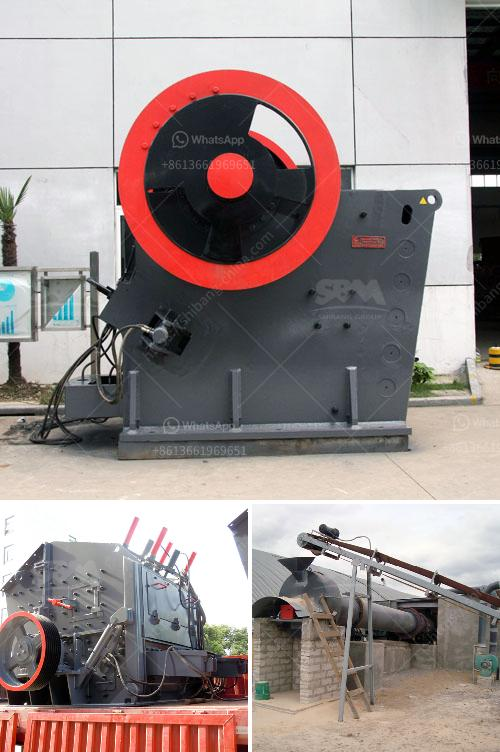

<h3>river pebble crusher manufacturer</h3>
River pebble is one of the largest materials for construction. With the continuous development of infrastructure construction, these natural pebbles have become valuable resources for various construction projects. To process river pebbles into required sizes for construction, a river pebble crusher manufacturer is needed before purchasing a suitable crusher.

River pebble crusher manufacturers have different technical and process requirements for their equipment, and the price of the equipment also varies to some extent. Different manufacturers have different production technologies and processes, which will affect the quality and performance of the equipment. Therefore, when selecting a river pebble crusher manufacturer, it is necessary to fully consider various factors to ensure the reliable operation and high efficiency of the equipment.

Firstly, it is important to choose a renowned manufacturer with a good reputation in the industry. A reliable manufacturer not only has advanced technology and good equipment quality but also has a perfect service system. This ensures that customers can get timely and comprehensive services when they encounter problems during the production process.

Secondly, the manufacturer should have rich experience in the production of river pebble crushers. Rich experience means that the manufacturer has accumulated a wealth of knowledge and skills in the production process, and is familiar with the production requirements of river pebble crushers. This can guarantee the quality of the equipment and reduce the occurrence of failures, prolonging the service life of the equipment.

In addition, the manufacturer should provide customers with a reasonable and cost-effective solution. Different customers have different production needs, so it is important for the manufacturer to provide personalized solutions according to the actual production requirements of customers. This includes selecting the appropriate type and model of the crusher, as well as providing the necessary supporting equipment and process design.

Furthermore, the manufacturer should have a comprehensive after-sales service system. After-sales service is an important part of the overall service of the manufacturer. A good after-sales service can provide technical support, equipment maintenance, and troubleshooting services in a timely manner, ensuring the smooth operation of the equipment and minimizing production downtime.

Overall, when choosing a river pebble crusher manufacturer, it is necessary to consider factors such as reputation, experience, solution design, and after-sales service. By selecting a reliable manufacturer, customers can ensure the quality and performance of the equipment, and achieve efficient and stable production of river pebble aggregates for construction projects.
<h3>Contact us</h3><ul><li><strong>Whatsapp:&nbsp;<a href="https://wa.me/8613661969651">+8613661969651</a></strong></li><li><a href="https://swt.shibang-china.com/?git&amp;zhl&amp;river pebble crusher manufacturer"><strong>Online Service(chat now)</strong></a></li></ul><h3>Related</h3><ul><li><a href='iron ore beneficiation flowsheet.md'>iron ore beneficiation flowsheet</a></li><li><a href='mobile stone crushing plant made in germany.md'>mobile stone crushing plant made in germany</a></li><li><a href='jaw crusher suppliers in mexico.md'>jaw crusher suppliers in mexico</a></li><li><a href='ball mill suppliers.md'>ball mill suppliers</a></li><li><a href='cement lime crusher.md'>cement lime crusher</a></li></ul>