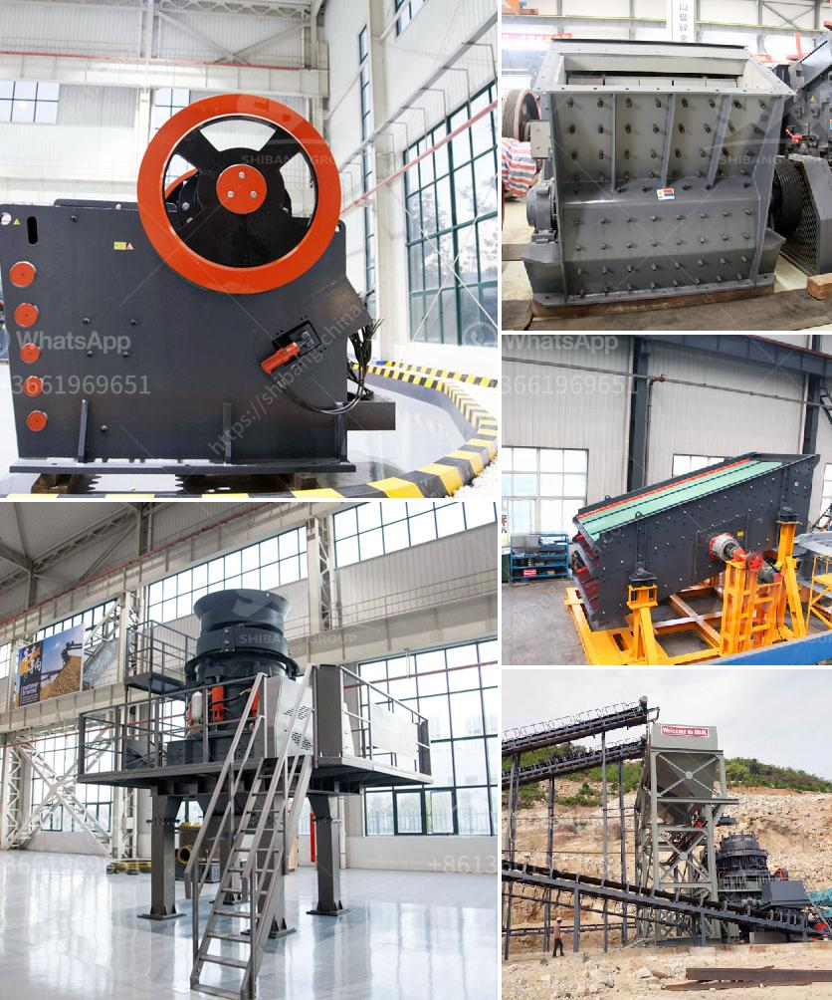

<h3>rock cone crusher</h3>
A cone crusher is a compression type of rock crusher that utilizes a mantle to crush materials. It works by squeezing the feed material between a moving piece of steel called the mantle and a stationary piece of steel called the concave. The crushing chamber is lined with a replaceable mantle, which provides more efficient crushing due to its longer lifespan compared to jaw crushers.

The cone crusher is widely used in mining, construction, road building, chemical, and metallurgical industries. Cone crushers are generally used to crush medium-hard to very hard materials such as limestone, granite, iron ore, basalt, etc. The best part about buying a cone crusher is that it significantly reduces the operating cost. With proper maintenance, the cone crusher can crush more material in less time, contributing to a reduction in energy consumption and overall operational cost.

One of the key features of cone crushers is their ability to transport materials to the desired location without the need for additional equipment. This is achieved through the unique design of the crushing chamber, which allows for a continuous flow of material. The material is fed into the cone crusher through a vibrating feeder or a conveyor belt. The cone crusher then breaks down the material into smaller pieces by the squeezing action of the mantle and concave. Once the desired size is achieved, the crushed material is discharged through an adjustable opening at the bottom of the crusher.

The cone crusher's design provides a high reduction ratio and a great consistency of shape, which is particularly important for the production of high-quality aggregates. The materials produced by a cone crusher have a better cubic shape, allowing for more precise and consistent grading and screening. This makes cone crushers ideal for secondary and tertiary crushing stages, where the aim is to obtain fine and homogeneous materials.

Another advantage of cone crushers is their versatility. The adjustable opening at the bottom of the crusher allows for the production of different-sized materials. This feature is particularly useful in applications where different specifications are required, such as in road construction or concrete production. The cone crusher can also be used in combination with other types of crushers, such as impact crushers or jaw crushers, to achieve a higher reduction ratio and finer end products.

In conclusion, the cone crusher is a versatile and reliable machine that can easily crush even the hardest materials. It offers high reduction ratios, excellent shape, and low operating costs. Whether used in aggregates production, mining operations, or recycling applications, the cone crusher proves to be an essential tool for any crushing process. Its ability to transport materials and produce high-quality products makes it the perfect choice for various industries. Investing in a cone crusher guarantees better efficiency, increased productivity, and reduced operational costs, leading to a better overall profitability.
<h3>Contact us</h3><ul><li><strong>Whatsapp:&nbsp;<a href="https://wa.me/8613661969651">+8613661969651</a></strong></li><li><a href="https://swt.shibang-china.com/?git&amp;zhl&amp;rock cone crusher"><strong>Online Service(chat now)</strong></a></li></ul><h3>Related</h3><ul><li><a href='basalt crusher price in senegal.md'>basalt crusher price in senegal</a></li><li><a href='portable track mounted mini jaw crusher.md'>portable track mounted mini jaw crusher</a></li><li><a href='grinding equipment cost estimate.md'>grinding equipment cost estimate</a></li><li><a href='kobe crushers singapore suppliers.md'>kobe crushers singapore suppliers</a></li><li><a href='impact stone crusher.md'>impact stone crusher</a></li></ul>