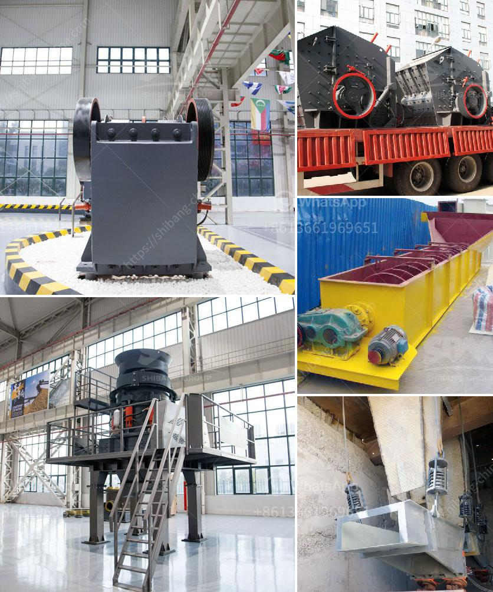

<h3>rock crusher for quartz</h3>
Rock crushers come in many shapes and sizes, from the strictly handheld to the complex industrial sizes, which can crush tons of rock and ore in one day. Making your own rock crusher invariably requires you or someone you know to possess some basic welding skills. Iron is the ore of choiQuartz Rock Crushing Services for Gold Dorel when it comes to breaking rocks into hand-sized pieces and a skilled or even semi-skilled welder are the only people who can shape iron. This particular kind of rock crusher is perfect for homeowners or amateur prospectors.

This type of rock crusher employs the compressive force to break up larger rocks into more manageable pieces. As the rock is compressed between the two plates, it gets crushed into smaller chunks. The movement of the jaw can be quite small since complete crushing is not performed in one stroke. The inertia required to crush the material is provided by a weighted flywheel that moves the shaft creating an eccentric motion that causes the closing of the gap.

When rocks are crushed, quartz is turned into particles of various sizes. Broken Quartz pieces range from very small sizes like granules to large rocks. The rock crusher effectively makes it easier to separate the cornerstone of quartz rock from large rocks, transforming them into small particles that can be used for other purposes. The rock crushers for soft to medium-hard rocks are designed to break down the materials into smaller chunks. Due to their efficiency, ease of use, and compact design, rock crushers are highly effective for sand, gravel, and landscaping projects.

The crushing process begins with the feeding of the rock particles into the crusher, which is set at a certain size to ensure that the results satisfy the requirements. Rocks are then crushed into smaller-sized particles through compression or impact. The smaller-sized particles are then passed through a set of sieves to ensure that the desired size of crushed rock is achieved. The crushed rock materials can then be used for various purposes, including construction and landscaping projects.

For homeowners or amateur prospectors, the rock crusher offers a cost-effective way to crush your rock for landscaping purposes, DIY projects, or even for resale. If you are new to rock crushers, read on to learn the basics of rock crushing and get tips on using your rock crusher to maximize its efficiency.

The first thing to consider when choosing a rock crusher is the type of rock being crushed. Quartz rocks are typically harder and more abrasive than traditional rocks, so choosing the right type of crusher is crucial. The first question that needs to be asked is whether you need compression or impact crushers. Both types of crushers have their advantages and disadvantages, but for quartz rock crushing, impact crushers are better.

Impact crushers are more effective at crushing quartz, since they produce more significant mechanical forces that break the rock structure. The impact forces make it easier to crack rocks along their natural fissures, creating sharp edges that are easier to crush further. Compression crushers, on the other hand, squeeze rocks under more significant pressure between two solid surfaces, which results in smaller particles. However, since quartz rocks are harder and more abrasive, impact crushers are typically more efficient and produce more on-spec particles.

Another factor to consider when choosing a rock crusher is the system of maintenance and repairs. Some manufacturers provide online support or comprehensive repair kits that make it easy for homeowners to repair their rock crushers themselves. On the other hand, some manufacturers require you to take your rock crusher to a service center when repairs are necessary. Consider the ease of maintenance and the availability of replacement parts when choosing a rock crusher.

When using a rock crusher for quartz rock crushing, it is essential to be mindful of the safety measures. Proper safety precautions must be taken, including wearing protective gloves and eyewear, and using a dust mask to prevent inhalation of dust particles. Additionally, never operate the rock crusher without first reading and understanding the manufacturer's instructions. Always consult the instruction manual for proper operation and maintenance to ensure personal safety and the longevity of the rock crusher.

In conclusion, rock crushers for crushing quartz rock can efficiently break down larger rocks into smaller particles that can be used for various purposes. Homeowners or amateur prospectors can invest in a rock crusher to enhance their DIY projects, landscaping, or reselling opportunities. Understanding the rock's hardness, choosing the right type of rock crusher, and taking proper safety precautions are crucial for a successful rock crushing experience.
<h3>Contact us</h3><ul><li><strong>Whatsapp:&nbsp;<a href="https://wa.me/8613661969651">+8613661969651</a></strong></li><li><a href="https://swt.shibang-china.com/?git&amp;zhl&amp;rock crusher for quartz"><strong>Online Service(chat now)</strong></a></li></ul><h3>Related</h3><ul><li><a href='ball mill made in usa.md'>ball mill made in usa</a></li><li><a href='hammer mills hammer mills.md'>hammer mills hammer mills</a></li><li><a href='prices of complete crushing plant of baxter brand.md'>prices of complete crushing plant of baxter brand</a></li><li><a href='silica quartz crusher processing.md'>silica quartz crusher processing</a></li><li><a href='rock cone crusher.md'>rock cone crusher</a></li></ul>