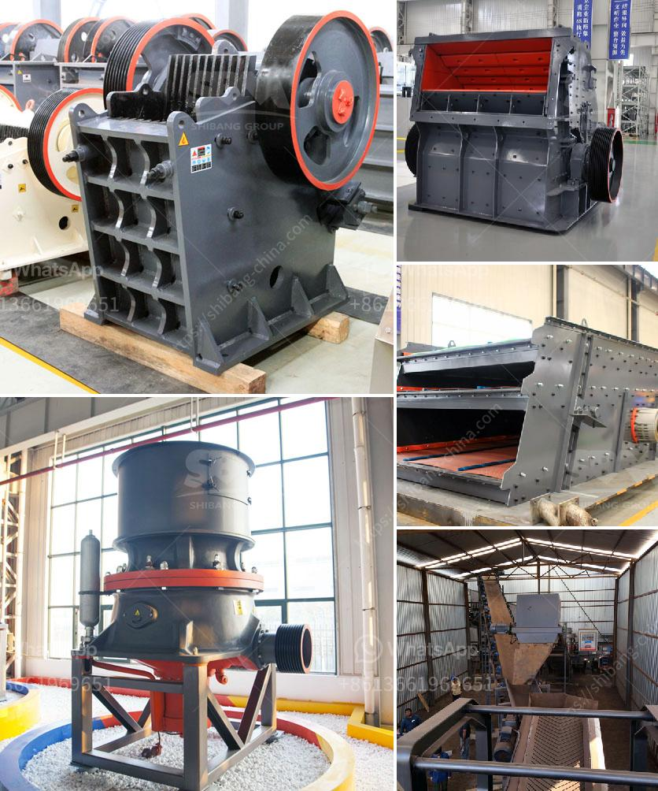

<h3>rock crusher for sale in botswana</h3>
Botswana is a landlocked country located in Southern Africa. It has a well-developed mining industry with diamond mining being the leading contributor to its economy. In recent years, the country has witnessed a surge in demand for construction materials, leading to an increased need for rock crushers. These machines have become crucial in the mining industry as they are capable of breaking down large rocks into smaller, more manageable sizes for further processing.

A rock crusher is a powerful machine that is used to crush rocks and reduce their size. It is commonly used in the mining industry as well as in construction sites where large rocks need to be crushed in order to be used for various purposes. There are different types of rock crushers available in the market, each designed for specific applications.

Buying a rock crusher is a significant investment, and it is essential to choose the right one that suits your needs. Factors such as the type of rock, size of the material, and desired end product should be taken into consideration before making a purchase. It is also vital to select a reliable and reputable supplier that offers high-quality machines and excellent after-sales service.

In Botswana, there are several reputable suppliers that offer rock crushers for sale. These suppliers understand the local mining industry and the specific requirements of their customers. They provide a wide range of rock crushers that are robust, efficient, and versatile. Whether you need a primary, secondary, or tertiary crusher, you can find the perfect machine to meet your needs.

Investing in a rock crusher for sale in Botswana can be a game-changer for mining companies and construction sites. It allows for the efficient processing of rocks, resulting in reduced costs and increased productivity. Moreover, crushing rocks into smaller sizes enables the mining industry to extract valuable minerals more effectively. As a result, rock crushers play a crucial role in driving the economic growth of Botswana.

In conclusion, the rock crusher market in Botswana is on the rise due to the country's booming mining and construction industries. With the right choice of a rock crusher, industry players can significantly enhance their operational efficiency and overall productivity. It is advisable to engage with reputable suppliers that offer quality machines to ensure long-term reliability and maximize return on investment.
<h3>Contact us</h3><ul><li><strong>Whatsapp:&nbsp;<a href="https://wa.me/8613661969651">+8613661969651</a></strong></li><li><a href="https://swt.shibang-china.com/?git&amp;zhl&amp;rock crusher for sale in botswana"><strong>Online Service(chat now)</strong></a></li></ul><h3>Related</h3><ul><li><a href='mobile clusher for hire tanzania.md'>mobile clusher for hire tanzania</a></li><li><a href='primary stone crusher for rent in karnataka.md'>primary stone crusher for rent in karnataka</a></li><li><a href='granite crushers manufacturers.md'>granite crushers manufacturers</a></li><li><a href='jaw crusher suppliers in mexico.md'>jaw crusher suppliers in mexico</a></li><li><a href='alluvial gold washing plants in south africa.md'>alluvial gold washing plants in south africa</a></li></ul>