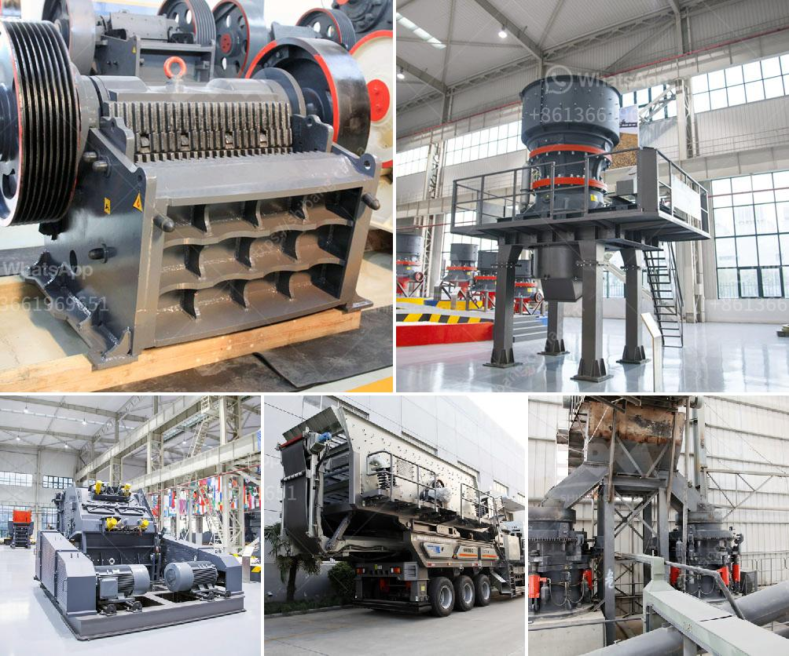

<h3>rock crusher iron balls</h3>
When we think of rock-crushing machines, we usually imagine huge industrial crushers breaking down mountains of stones into smaller pieces. But did you know that some rock crushers also feature iron balls? These iron balls are used to crush the rocks further into powder or dust. In this article, we will explore the role of iron balls in rock crushing and evaluate their effectiveness as a weapon in this arduous process.

The concept of using iron balls to crush rocks dates back to the early 19th century. Over time, ball mills evolved into powerful crushing machines that could easily reduce the size of rocks into powdered form. This innovative technique revolutionized the mining industry, enabling it to extract valuable minerals more efficiently.

So, how do rock crusher iron balls work exactly? These iron balls, also known as ball mill media or grinding media, are placed inside a large rotating drum. As the drum rotates, the iron balls grind the rocks against the inner surface of the drum, effectively reducing their size. This process is known as rock comminution, and it plays a crucial role in various industries, including mining, cement production, and construction.

However, the use of iron balls in rock crushing raises several questions. Are these iron balls merely tools, or can they be used as weapons? Can they cause damage or harm beyond their intended purpose in rock crushing?

The truth is that rock crusher iron balls are not as dangerous as they may sound. Although they are solid iron, they are usually not designed to be shot or thrown. The iron balls are engineered for strength, durability, and effectiveness in reducing the size of rocks, not for causing harm to humans or animals.

It's important to understand that the intended use of these iron balls is in controlled environments where a rock crusher is operated by skilled professionals. They are used solely for their rock-crushing properties and are not designed for any other purpose. In fact, the sheer weight and size of these iron balls make them unsuitable for use as weapons.

While it may be tempting to think of these iron balls as a potential weapon, their practicality as such is limited. The sheer weight and difficulty of handling them, along with their narrow application, make them unsuitable for any other use beyond rock crushing.

In conclusion, rock crusher iron balls are an integral part of the rock crushing process. Used in ball mills, they are responsible for reducing rocks into a powdered or dust-like form. While they may sound menacing, these iron balls are not designed as weapons and are used solely for their intended purpose. Therefore, the notion of them being used as a weapon outside of a controlled rock crushing environment is unfounded.
<h3>Contact us</h3><ul><li><strong>Whatsapp:&nbsp;<a href="https://wa.me/8613661969651">+8613661969651</a></strong></li><li><a href="https://swt.shibang-china.com/?git&amp;zhl&amp;rock crusher iron balls"><strong>Online Service(chat now)</strong></a></li></ul><h3>Related</h3><ul><li><a href='3 meters conveyor belts.md'>3 meters conveyor belts</a></li><li><a href='hammer mill for gold.md'>hammer mill for gold</a></li><li><a href='coal crushing and screening plant setup.md'>coal crushing and screening plant setup</a></li><li><a href='clay grinder mill machine.md'>clay grinder mill machine</a></li><li><a href='concrete crusher prices.md'>concrete crusher prices</a></li></ul>