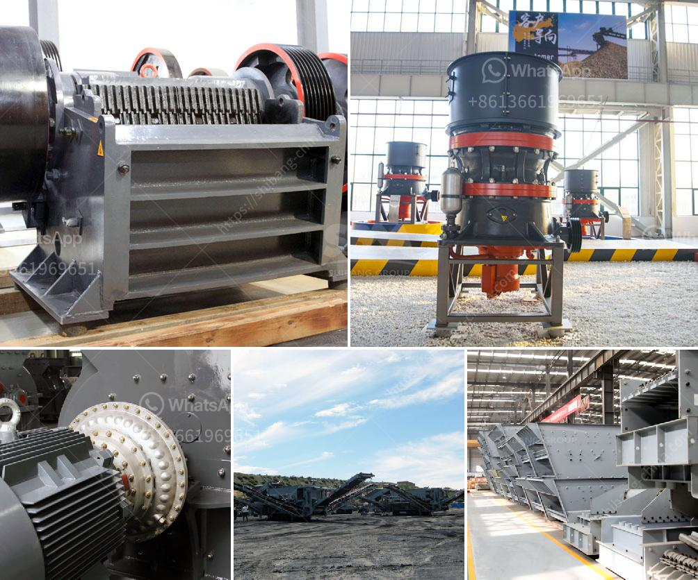

<h3>rock crusher rock crusher</h3>
A rock crusher is a machine designed to break large rocks into smaller ones. It can crush rocks of various sizes and compositions, from soft to very hard rocks. The size reduction process includes primary crushing, secondary crushing, and tertiary crushing stages.

Rock crushers are typically used in quarry operations, mining, demolition, and recycling applications. The main purpose of a rock crusher is to reduce the size of the rocks to a size that can be transported easily, stored, and processed for further use. Various types of rock crushers are available, such as jaw crushers, gyratory crushers, impact crushers, and cone crushers.

One of the most popular rock crushers is a jaw crusher. It is designed to crush hard and abrasive rocks into small particles. The jaw crusher consists of a fixed jaw and a movable jaw, which can be moved back and forth by the eccentric shaft. When the rock enters the crushing chamber, the movable jaw exerts force on it, crushing it against the fixed jaw.

The primary advantage of a jaw crusher is its simplicity and reliability. It requires less maintenance compared to other types of crushers and has a longer lifespan. It is also efficient in crushing hard and tough rocks.

Another type of rock crusher is an impact crusher. It is used to crush softer rocks, such as limestone and sandstone. In an impact crusher, the rock is thrown against a hard surface, either a rock or a piece of metal, causing it to break into smaller pieces. This type of crusher is commonly used in recycling applications, as it can crush and reshape recycled materials.

A gyratory crusher is another popular rock crusher. It is similar to a jaw crusher, but has a conical head and a concave surface. The rock is fed into the crushing chamber and crushed between the head and the concave surface. Gyratory crushers are used in mining, quarrying, and aggregate production applications.

Cone crushers are also widely used in the rock crushing industry. They are similar to gyratory crushers but have a different shape of the crushing chamber. The rock is crushed between a mantle, which is mounted on a rotating eccentric shaft, and a concave bowl liner. Cone crushers are used in secondary and tertiary crushing stages.

The choice of a rock crusher depends on various factors, including the type of rock to be crushed, the required final product size, the capacity, and the cost. It is important to consider all these factors to select the right rock crusher for a specific application.

In conclusion, a rock crusher is a powerful machine that is used to reduce the size of rocks and process them for further use. There are various types of rock crushers, such as jaw crushers, impact crushers, gyratory crushers, and cone crushers. Each type has its own advantages and is suitable for different applications. Choosing the right rock crusher is crucial for efficient and effective crushing operations.
<h3>Contact us</h3><ul><li><strong>Whatsapp:&nbsp;<a href="https://wa.me/8613661969651">+8613661969651</a></strong></li><li><a href="https://swt.shibang-china.com/?git&amp;zhl&amp;rock crusher rock crusher"><strong>Online Service(chat now)</strong></a></li></ul><h3>Related</h3><ul><li><a href='mini lava rock crusher for homeowner.md'>mini lava rock crusher for homeowner</a></li><li><a href='stone grinding mills in pakistan.md'>stone grinding mills in pakistan</a></li><li><a href='the process of preparation coal.md'>the process of preparation coal</a></li><li><a href='roller mill for dolmite.md'>roller mill for dolmite</a></li><li><a href='sale of stone hammer hammer.md'>sale of stone hammer hammer</a></li></ul>