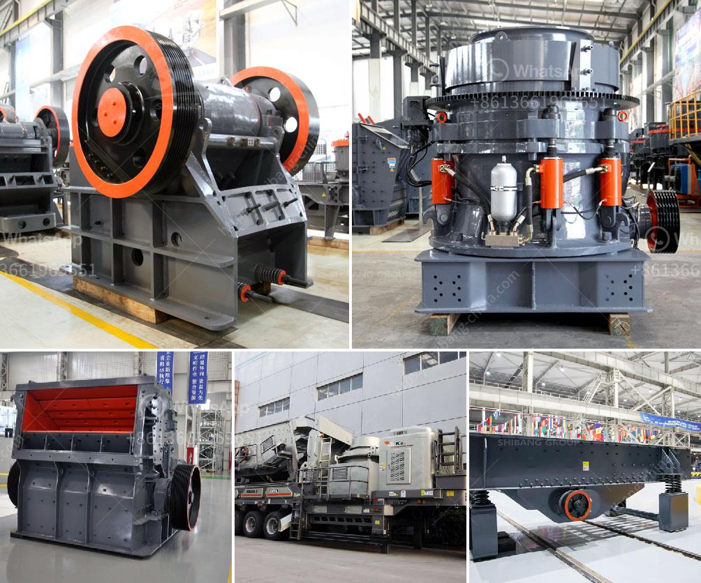

<h3>rock crushing machines for sale</h3>
Rock crushing machines are indispensable equipment in the mining and quarrying industry. These machines help break down large rocks into smaller, more manageable sizes for further processing. Whether you are a professional contractor or a DIY enthusiast, investing in a rock crushing machine is a smart decision.

One of the primary advantages of rock crushing machines is their versatility. These machines can handle a wide range of materials, from soft rocks to hard stones and everything in between. They are perfect for crushing various types of aggregates, such as gravel, limestone, and granite.

Another key benefit of using rock crushing machines is their efficiency. These machines are designed to crush rocks quickly and efficiently, saving you time and labor. Their powerful motors and durable components ensure that they can withstand heavy-duty use, making them ideal for industrial applications.

When it comes to choosing the right rock crushing machine, there are several factors to consider. First and foremost, you need to assess your specific needs and requirements. This will help you determine the size and type of machine that is best suited for your project.

Additionally, it's crucial to select a machine that is easy to operate and maintain. Look for machines that come with user-friendly controls and are designed for easy access to critical components for cleaning and maintenance purposes. This will help ensure that your rock crushing machine remains in optimal condition and operates smoothly for years to come.

Fortunately, there are numerous rock crushing machines for sale in the market today. You can choose from a variety of options, including jaw crushers, cone crushers, impact crushers, and more. Each type of machine has its own unique features and benefits, so it's important to do thorough research and compare different models before making a decision.

In conclusion, rock crushing machines are a valuable investment for anyone involved in the mining and quarrying industry. They provide an efficient and effective solution for breaking down rocks into smaller sizes, making them easier to handle and process. With their versatility, efficiency, and wide range of options available, there is undoubtedly a rock crushing machine that will meet your specific needs and deliver excellent results. So, don't hesitate to explore the market and find the perfect machine for your crushing requirements.
<h3>Contact us</h3><ul><li><strong>Whatsapp:&nbsp;<a href="https://wa.me/8613661969651">+8613661969651</a></strong></li><li><a href="https://swt.shibang-china.com/?git&amp;zhl&amp;rock crushing machines for sale"><strong>Online Service(chat now)</strong></a></li></ul><h3>Related</h3><ul><li><a href='price of ball mill for sale.md'>price of ball mill for sale</a></li><li><a href='cement ball mill cement mill for sale.md'>cement ball mill cement mill for sale</a></li><li><a href='jaw crusher 0 5 t 1ton per hour.md'>jaw crusher 0 5 t 1ton per hour</a></li><li><a href='standard ratio for cement sand building blocks.md'>standard ratio for cement sand building blocks</a></li><li><a href='used crusher for sale in jamaica.md'>used crusher for sale in jamaica</a></li></ul>