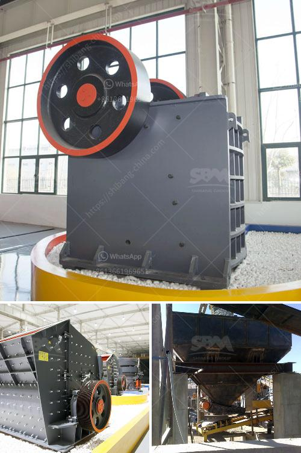

<h3>rock jaw crusher</h3>
Rock jaw crusher is one of the most widely used crushing machines in mining, quarrying, and construction industries. It is specially designed for crushing any type of stone or hard materials, such as granite, marble, basalt, limestone, quartz, iron ore, concrete, and aggregate. The rock jaw crusher is capable of processing materials with a compressive strength up to 320MPa and has the features of excellent performance, durable structure, high production efficiency, energy saving, and environmental-friendly.

One of the key advantages of rock jaw crusher is its ability to process hard materials with high efficiency. This crusher uses a motor to drive the belt and pulley, making the movable jaw move up and down through an eccentric shaft. When the movable jaw rises, the angle between the toggle plate and the movable jaw becomes larger, allowing the materials to be crushed. On the contrary, when the movable jaw goes down, the angle decreases, and the crushed materials are discharged from the discharge port. This simple mechanism ensures a smooth and efficient crushing process.

The rock jaw crusher is also known for its low maintenance and operation costs. It has a limited number of parts and requires minimal attention during operation. However, regular maintenance and repairs are crucial in ensuring the crusher's longevity. Common maintenance tasks include lubrication, inspection of wear parts, and replacing damaged or worn-out components.

Moreover, rock jaw crusher is designed with environmental considerations in mind. It is equipped with a dust suppression system that reduces the amount of dust and noise produced during the crushing process. Additionally, the crusher is designed to minimize vibration, which further reduces noise and provides a more comfortable working environment. This feature is especially important in urban areas where noise pollution is a concern.

Rock jaw crusher is also available in different sizes and capacities to meet the specific requirements of different industries. It can be used as a primary crusher for large-scale mining operations or as a secondary crusher in smaller-scale operations. Its versatility enables it to be used in various applications, including demolition, recycling, and road construction.

In conclusion, rock jaw crusher is a valuable machine that has numerous advantages, including high crushing ratio, efficiency, low maintenance, and eco-friendliness. The machine is designed to crush stone or hard materials with exceptional performance and is widely used in various fields, such as mining, quarrying, and construction industries. With its versatile applications and environmentally friendly features, the rock jaw crusher is an essential equipment in any crushing plant.
<h3>Contact us</h3><ul><li><strong>Whatsapp:&nbsp;<a href="https://wa.me/8613661969651">+8613661969651</a></strong></li><li><a href="https://swt.shibang-china.com/?git&amp;zhl&amp;rock jaw crusher"><strong>Online Service(chat now)</strong></a></li></ul><h3>Related</h3><ul><li><a href='mill price for minerals in bolivia.md'>mill price for minerals in bolivia</a></li><li><a href='cobalt ore processing plant supplier.md'>cobalt ore processing plant supplier</a></li><li><a href='simple stone crusher dubai.md'>simple stone crusher dubai</a></li><li><a href='price list sag mill for sale.md'>price list sag mill for sale</a></li><li><a href='model pe 250 400 bantalan jaw crusher.md'>model pe 250 400 bantalan jaw crusher</a></li></ul>