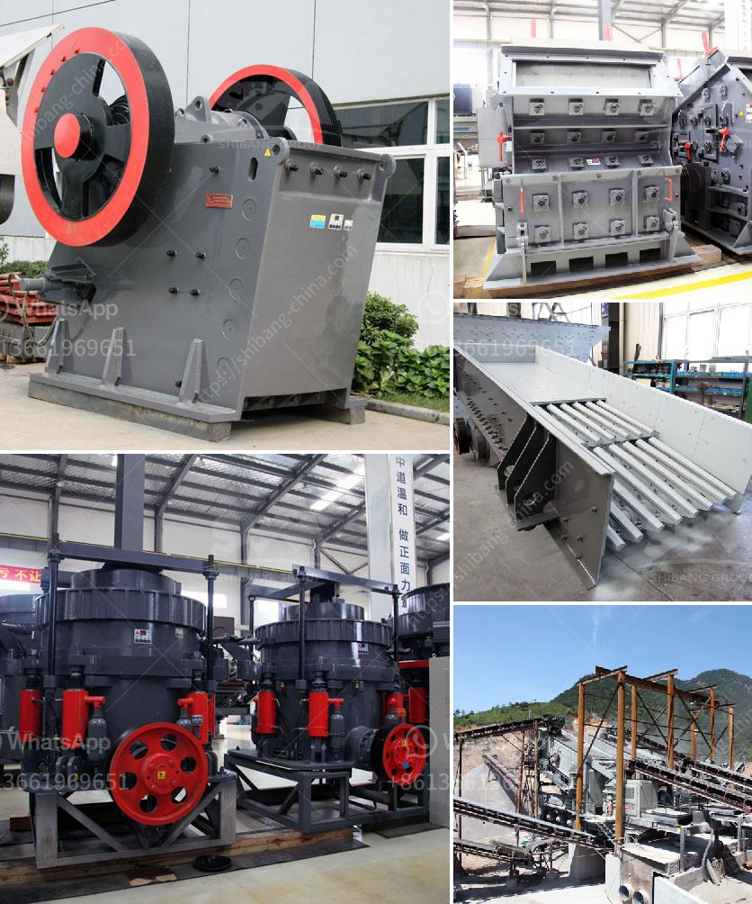

<h3>rock processing plant equipment</h3>
Rock processing plants, or quarries, are essentially industrial sites where raw materials for construction and other applications are extracted from the earth. These facilities rely on a range of equipment to prepare rocks and stones for use in various projects. In recent years, advancements in technology have led to the development of cutting-edge equipment that promises increased efficiency, productivity, and cost-effectiveness for these processing plants.

One crucial piece of equipment in a rock processing plant is the crusher. As the name suggests, crushers are machines designed to break larger rocks into smaller, more manageable sizes. Traditional crushers, such as jaw crushers and cone crushers, have long been used for this purpose. However, recent innovations have resulted in the development of highly efficient crushers that offer superior performance.

For instance, impact crushers have gained significant popularity due to their ability to produce a more cubical-shaped end product. These crushers utilize rapidly rotating hammers or bars to impact rocks and break them down. Their design enables them to handle a wide range of materials, from soft limestone to hard granite, making them versatile in various rock processing applications.

In addition to crushers, screens are another essential equipment at a rock processing plant. Screens are used to separate rocks into different sizes according to the project's requirements. Traditionally, screens have been built with layers of mesh that allow smaller sizes to pass through while retaining larger rocks. However, modern screens now incorporate advanced technologies such as vibrating screens, which offer improved efficiency and precision.

Vibrating screens utilize vibrations to separate the material based on size, resulting in more accurate and efficient screening. This technology minimizes the chances of clogging and increases throughput, reducing downtime for maintenance. Furthermore, vibrating screens can be equipped with additional features such as self-cleaning mechanisms, further enhancing their overall efficiency.

Material handling equipment also plays a vital role in rock processing plants. These machines are responsible for moving materials from one location to another within the facility. Conveyors are commonly used for this purpose, allowing for the seamless transfer of rocks and stones to different processing stages. Innovations in conveyor systems have led to the development of highly reliable and versatile equipment capable of handling a wide range of materials.

Moreover, advancements in automation and digitalization have further revolutionized rock processing plants. Automation allows for increased precision, reduced human error, and improved overall productivity. Operators can now control and monitor equipment remotely, optimizing performance while minimizing the need for manual intervention. Digitalization also provides valuable data insights, enabling operators to make more informed decisions and identify areas for process improvement.

Overall, the development of modern equipment for rock processing plants has transformed the industry, bringing increased efficiency, productivity, and cost-effectiveness. Crushers, screens, material handling equipment, and automation technologies have paved the way for enhanced performance and reduced downtime. As the demand for construction materials continues to grow, the importance of these advances cannot be overstated. By investing in state-of-the-art equipment, rock processing plants can position themselves for success in a competitive market while also promoting sustainable practices.
<h3>Contact us</h3><ul><li><strong>Whatsapp:&nbsp;<a href="https://wa.me/8613661969651">+8613661969651</a></strong></li><li><a href="https://swt.shibang-china.com/?git&amp;zhl&amp;rock processing plant equipment"><strong>Online Service(chat now)</strong></a></li></ul><h3>Related</h3><ul><li><a href='manufacturer of crushing plant malaysia.md'>manufacturer of crushing plant malaysia</a></li><li><a href='quartz making machine germany.md'>quartz making machine germany</a></li><li><a href='large gravel powder machine.md'>large gravel powder machine</a></li><li><a href='gypsum processing plant in.md'>gypsum processing plant in</a></li><li><a href='cone crusher plant for sale.md'>cone crusher plant for sale</a></li></ul>