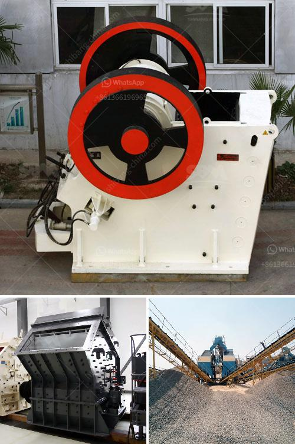

<h3>rock pulverizer for manufacturing</h3>
Rock pulverizers are heavy-duty machines designed to crush and grind rocks into smaller particles. They are commonly used in the construction, mining, and manufacturing industries for various applications. From road construction to concrete production, rock pulverizers play a crucial role in breaking down hard materials for further processing. This article will explore the importance of rock pulverizers in manufacturing processes and their key benefits.

One of the primary uses of rock pulverizers in manufacturing is in material preparation. Many products that we use in our daily lives, such as concrete, asphalt, and ceramics, require finely crushed rocks as their base material. Rock pulverizers grind large rocks into smaller particles, which can then be mixed with other materials to create various products. This process is essential for achieving the desired consistency and quality of the final product.

Another critical application of rock pulverizers in manufacturing is in the production of building materials. For instance, pulverized rocks are used as aggregates in concrete and asphalt production. By crushing rocks into uniform sizes, pulverizers ensure the durability and strength of these materials. Additionally, pulverized rocks can be used as fillers in various manufacturing processes, providing stability and reducing costs.

Rock pulverizers are also widely used in the mining industry for ore processing. Raw ores extracted from mines usually contain large chunks of rock that are too big for further processing. Pulverizers crush these rocks into smaller pieces, allowing for more efficient extraction of valuable minerals. This not only increases the yield of the mining process but also reduces the overall energy consumption required for further processing.

One of the key benefits of using rock pulverizers in manufacturing is their versatility. These machines can crush and grind a wide range of rocks, from soft limestone to hard granite. This versatility enables manufacturers to process different types of rocks, depending on their specific needs and requirements. Furthermore, rock pulverizers can achieve different levels of fineness, allowing for customization and optimization of manufacturing processes.

In addition to versatility, rock pulverizers offer exceptional efficiency and productivity. These machines are designed to crush rocks quickly and efficiently, minimizing downtime and increasing production rates. The continuous operation of rock pulverizers ensures a steady supply of crushed rocks, streamlining the manufacturing process. Moreover, advanced models of rock pulverizers incorporate features like automatic feeding and discharge systems, further enhancing productivity.

Lastly, rock pulverizers contribute to environmental sustainability. By crushing and grinding rocks into smaller particles, these machines help reduce waste and optimize resource utilization. Pulverized rocks are easier to handle and transport, resulting in efficient logistics and reduced carbon emissions. Additionally, by substituting natural resources with pulverized rocks, manufacturers can minimize their ecological footprint and promote a circular economy.

In conclusion, rock pulverizers are essential machines in the manufacturing industry. They play a crucial role in material preparation, building material production, and mining processes. Offering versatility, efficiency, and sustainability, rock pulverizers are indispensable for the production of various goods. As technology continues to advance, we can expect more efficient and eco-friendly rock pulverizers that will further revolutionize the manufacturing landscape.
<h3>Contact us</h3><ul><li><strong>Whatsapp:&nbsp;<a href="https://wa.me/8613661969651">+8613661969651</a></strong></li><li><a href="https://swt.shibang-china.com/?git&amp;zhl&amp;rock pulverizer for manufacturing"><strong>Online Service(chat now)</strong></a></li></ul><h3>Related</h3><ul><li><a href='process of granite mining crusher machines used.md'>process of granite mining crusher machines used</a></li><li><a href='cost of 500 tonnes per day cement plant ecuador.md'>cost of 500 tonnes per day cement plant ecuador</a></li><li><a href='vibrating screens manufacturers.md'>vibrating screens manufacturers</a></li><li><a href='diatomite impact grinding mill.md'>diatomite impact grinding mill</a></li><li><a href='mica processing machinery pictures.md'>mica processing machinery pictures</a></li></ul>