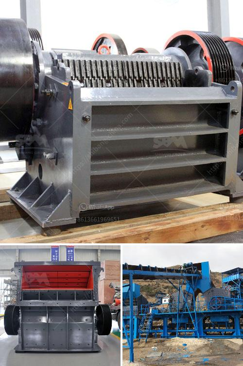

<h3>roll ball mill manufacturers</h3>
Roll ball mills are machines used to grind materials into extremely fine powder for use in mineral dressing processes, paints, pyrotechnics, ceramics, and selective laser sintering. The concept of the roll ball mill is simple: the container revolves around a horizontal axis and is filled with grinding media, usually balls or cylpebs or other more exotic media trends. These grinding media are then crushed by the rolling action of the container itself, creating a high-energy impact between the balls and the material being ground.

Roll ball mills have become increasingly popular in recent years due to their ability to grind materials down to the nanometer scale. This level of fineness is required in many industries, especially those involved in research and development, where the demands for ultra-fine particles are ever-increasing. Additionally, roll ball mills are more energy-efficient compared to other types of mills, such as vibratory mills or attritor mills, making them an economical choice for businesses.

There are numerous roll ball mill manufacturers in the market today, each offering its unique features and advantages. Selecting the right manufacturer is crucial to ensure the efficiency and reliability of your milling process. Here are a few well-known roll ball mill manufacturers:

1. Fritsch: Fritsch is a German manufacturer known for its high-quality laboratory-scale roll ball mills. Their mills are widely used in various research laboratories and universities due to their precise control over grinding parameters and the ability to produce uniformly sized particles.

2. Retsch: Retsch, also a German manufacturer, offers a range of roll ball mills designed for various applications, from the pharmaceutical industry to nanotechnology research. They provide high-quality equipment with advanced safety features and ergonomic designs.

3. Changsha Tianchuang Powder Technology Co., Ltd: This Chinese manufacturer offers roll ball mills for both laboratory-scale and industrial-scale applications. They are known for their extensive range of products and the ability to customize their mills according to customer requirements.

4. Across International: Across International is an American manufacturer that specializes in roll ball mills for scientific research and industrial applications. They offer a variety of models with different grinding capacities and features, such as temperature control and vacuum sealing.

When choosing a roll ball mill manufacturer, consider factors such as the required fineness of the ground material, the capacity of the mill, and the availability of spare parts and technical support. It is also important to verify the manufacturer's reputation and experience in the industry.

In conclusion, roll ball mills are essential equipment for grinding materials into ultra-fine powder. Selecting the right roll ball mill manufacturer is crucial in ensuring the efficiency and reliability of the milling process. With several well-known manufacturers offering a range of products, businesses can find the ideal roll ball mill to suit their specific needs.
<h3>Contact us</h3><ul><li><strong>Whatsapp:&nbsp;<a href="https://wa.me/8613661969651">+8613661969651</a></strong></li><li><a href="https://swt.shibang-china.com/?git&amp;zhl&amp;roll ball mill manufacturers"><strong>Online Service(chat now)</strong></a></li></ul><h3>Related</h3><ul><li><a href='ball mill spares manufacturers in india.md'>ball mill spares manufacturers in india</a></li><li><a href='3 4 inch crushed limestone.md'>3 4 inch crushed limestone</a></li><li><a href='cost of malaysia mobile crusher in india.md'>cost of malaysia mobile crusher in india</a></li><li><a href='crushing machine manufacturer in pakistan price.md'>crushing machine manufacturer in pakistan price</a></li><li><a href='concrete crushing machine in india.md'>concrete crushing machine in india</a></li></ul>