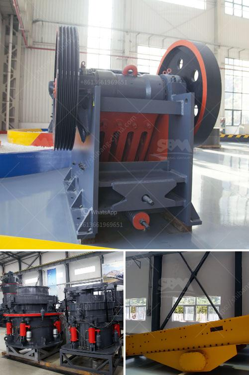

<h3>roll grinders manufacturers</h3>
Roll grinders are an integral part of many industrial processes that require precision grinding of heavy-duty materials. These machines are specifically designed to grind cylindrical surfaces of rolls, used in various industries such as paper mills, steel mills, and textile mills. Roll grinder manufacturers play a crucial role in providing efficient and reliable machinery to meet the diverse needs of these industries.

One of the leading roll grinder manufacturers in the market is XYZ Ltd. With over 20 years of experience, XYZ Ltd. has established itself as a reputable name in the industry. They are known for their high-quality roll grinders that deliver exceptional performance, accuracy, and reliability. The company utilizes advanced technologies and innovative design approaches to manufacture machines that meet stringent industry standards.

XYZ Ltd. understands that different industries have different requirements when it comes to roll grinding. Therefore, they offer a wide range of models with varying specifications to cater to the diverse needs of their customers. Whether it is a small paper mill or a large steel mill, XYZ Ltd. has a roll grinder to suit every requirement. Their machines can accommodate different roll sizes and weights, ensuring versatility and flexibility.

What sets XYZ Ltd. apart from other roll grinder manufacturers is their commitment to customer satisfaction. They work closely with their clients to understand their specific needs and provide tailored solutions accordingly. Whether it is a custom-designed roll grinder or modifications to an existing model, XYZ Ltd. goes the extra mile to meet customer expectations. This personalized approach has earned them a loyal customer base.

Another renowned roll grinder manufacturer is ABC Inc. With decades of experience in the industry, ABC Inc. has a deep understanding of the intricacies of roll grinding. They specialize in manufacturing heavy-duty roll grinders that can handle the toughest grinding applications. Their machines are known for their robust construction, high grinding precision, and long-term durability.

ABC Inc. prides itself on its state-of-the-art manufacturing facilities and cutting-edge technologies. They use advanced machining processes to ensure the highest level of accuracy and quality in their roll grinders. Additionally, their machines are equipped with advanced control systems that allow for precise control over various grinding parameters, resulting in superior grinding results.

Aside from providing high-quality roll grinders, ABC Inc. also offers comprehensive after-sales support to their customers. Their team of experienced technicians is always ready to assist with installation, training, and maintenance of their machines. This ensures that customers can optimize the performance and lifespan of their roll grinders, minimizing downtime and maximizing productivity.

In conclusion, roll grinders are essential machines for many industries requiring precise grinding of rolls. Roll grinder manufacturers like XYZ Ltd. and ABC Inc. play a vital role in providing efficient, reliable, and high-quality machinery to meet the diverse needs of these industries. With their advanced technologies, innovative designs, and commitment to customer satisfaction, these manufacturers are contributing to the success and growth of their clients' businesses.
<h3>Contact us</h3><ul><li><strong>Whatsapp:&nbsp;<a href="https://wa.me/8613661969651">+8613661969651</a></strong></li><li><a href="https://swt.shibang-china.com/?git&amp;zhl&amp;roll grinders manufacturers"><strong>Online Service(chat now)</strong></a></li></ul><h3>Related</h3><ul><li><a href='size of a 50 tpd rotary kiln.md'>size of a 50 tpd rotary kiln</a></li><li><a href='feasibility study on stone crushing.md'>feasibility study on stone crushing</a></li><li><a href='china best crusher manufacturers.md'>china best crusher manufacturers</a></li><li><a href='utiliza equipos de molienda fina molino.md'>utiliza equipos de molienda fina molino</a></li><li><a href='marble stone sheet production line.md'>marble stone sheet production line</a></li></ul>