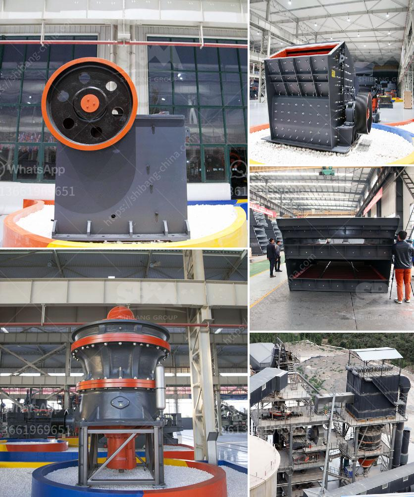

<h3>roll milling process</h3>
Roll milling is a metalworking process that involves the use of multiple cylindrical rollers to shape and flatten metal sheets, plates, and bars. It is commonly used in industries such as automotive, aerospace, and manufacturing to achieve precise dimensions, improve surface finish, and enhance mechanical properties of various metal products.

The roll milling process starts by feeding the metal workpiece between the rotating rollers. As the rolls turn, they exert compressive force on the metal, causing it to deform plastically. The desired shape and thickness are achieved by adjusting the roll gaps and roll speeds. This process is often used to reduce the thickness of metal sheets or plates, or to create specific profiles and textures on their surfaces.

One of the key advantages of roll milling is its ability to provide consistent thickness control. Unlike other metalworking processes, such as forging or extrusion, roll milling offers precise control over the reduction in thickness. This is particularly important in industries where tight dimensional tolerances are required, such as in automotive body panels or aircraft skin sheets. By controlling the roll gaps and applying consistent pressure, manufacturers can ensure that the final product meets the desired specifications.

In addition to thickness control, roll milling also improves the surface finish of metal products. As the metal is compressed between the rolls, any rough surfaces or imperfections are smoothed out. This results in a more aesthetically pleasing final product with enhanced visual appeal. Moreover, the improved surface finish can also contribute to better corrosion resistance and durability of the metal.

Furthermore, roll milling can also enhance the mechanical properties of the metal. By subjecting the metal to compressive forces, the grain structure of the material is refined, leading to increased strength and hardness. This is particularly beneficial for materials that require high strength and toughness, such as structural components or load-bearing parts. Additionally, the increased density of the metal can also improve its fatigue resistance and overall performance.

However, like any metalworking process, there are also limitations to roll milling. The process is most effective on materials that have good plasticity and can be easily deformed. Brittle materials, such as cast iron or certain ceramics, are not suitable for roll milling due to their tendency to crack or fracture during the process. Additionally, roll milling is typically a slower process compared to techniques like extrusion or stamping, which can limit its application in high-volume production settings.

In conclusion, roll milling is a versatile metalworking process that offers several advantages in terms of thickness control, surface finish, and mechanical properties enhancement. It is widely used in various industries to shape and flatten metal sheets, plates, and bars. However, it is crucial to consider the material properties and process limitations before implementing roll milling in production processes. With careful planning and optimization, manufacturers can leverage roll milling to achieve high-quality, dimensionally accurate, and mechanically robust metal products.
<h3>Contact us</h3><ul><li><strong>Whatsapp:&nbsp;<a href="https://wa.me/8613661969651">+8613661969651</a></strong></li><li><a href="https://swt.shibang-china.com/?git&amp;zhl&amp;roll milling process"><strong>Online Service(chat now)</strong></a></li></ul><h3>Related</h3><ul><li><a href='sample contract mining agreement.md'>sample contract mining agreement</a></li><li><a href='100 mt hr stone crusher machine.md'>100 mt hr stone crusher machine</a></li><li><a href='marble milling machine.md'>marble milling machine</a></li><li><a href='size and number of balls for ball mill.md'>size and number of balls for ball mill</a></li><li><a href='typical flow sheet for granite quarry.md'>typical flow sheet for granite quarry</a></li></ul>