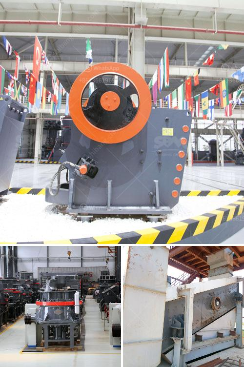

<h3>roller mill corrugation</h3>
Roller mills have been a staple in the milling industry for decades, revolutionizing the way grains are processed and ground. One of the critical components that contribute to the success of roller mills is the corrugation pattern on the rolls. Corrugation plays a pivotal role in achieving efficient grinding processes, ensuring consistent particle size distribution, and improving overall performance.

Corrugation refers to the shape or pattern of ridges on the surface of the rolls. It is essential to understand the design and functionality of various corrugation patterns to optimize the operations of roller mills. Multiple factors, including material type, mill settings, and desired final product characteristics, dictate the choice of corrugation pattern.

There are two main types of corrugation patterns utilized in roller mills: differential corrugation and smooth corrugation. Differential corrugation involves alternating ridges and valleys, while smooth corrugation has a uniform ridge height across the roll surface. Each type has its advantages and is chosen based on the requirements of the milling process.

Differential corrugation patterns are particularly useful when a wide variety of materials need to be processed. By utilizing varying ridges and valleys, the differential corrugation provides an increased grinding area, enhancing grinding efficiency. It allows for increased contact between the rolls and the material, resulting in a more uniform and consistent grind. This type of corrugation pattern excels in producing fine and ultra-fine grinds needed for specialty flours, animal feeds, and other applications where particle size uniformity is crucial.

On the other hand, smooth corrugation patterns are preferred for applications that require a more coarse and granular grind, such as corn or other grains used for animal feed. The uniform height of ridges in smooth corrugation patterns prevents excessive grinding, leading to reduced fines and improved overall efficiency. This type of corrugation pattern is also known to provide better flour quality, with reduced bran contamination and improved separation of endosperm.

It is worth mentioning that the corrugation pattern does not solely depend on the type of material being processed. Mill operators need to consider other factors, such as desired particle size distribution, throughput requirements, and energy consumption. By choosing the appropriate corrugation pattern, mill operators can maximize the milling process's efficiency while achieving the desired final product quality.

Maintaining the appropriate corrugation pattern on the rolls is crucial for consistent performance in roller mills. Over time, the corrugation may wear off, affecting the milling process's efficiency and particle size distribution. Regular inspection of the rolls and timely regrinding or replacement of worn-out rolls is necessary to ensure optimal performance.

In conclusion, roller mill corrugation is a critical aspect of grinding processes that significantly impacts efficiency and consistency. Understanding the significance of different corrugation patterns and their suitability for various applications empowers mill operators to achieve desired grind characteristics and final product quality. With proper maintenance and attention to corrugation, roller mills can continue to provide reliable and cost-effective milling solutions for a variety of industries.
<h3>Contact us</h3><ul><li><strong>Whatsapp:&nbsp;<a href="https://wa.me/8613661969651">+8613661969651</a></strong></li><li><a href="https://swt.shibang-china.com/?git&amp;zhl&amp;roller mill corrugation"><strong>Online Service(chat now)</strong></a></li></ul><h3>Related</h3><ul><li><a href='industrial grinding plant.md'>industrial grinding plant</a></li><li><a href='cost of setting up a production plant for tantalum.md'>cost of setting up a production plant for tantalum</a></li><li><a href='stone crusher finance project myanmar.md'>stone crusher finance project myanmar</a></li><li><a href='working machine of a stone crusher.md'>working machine of a stone crusher</a></li><li><a href='regulatory conveyor belts.md'>regulatory conveyor belts</a></li></ul>