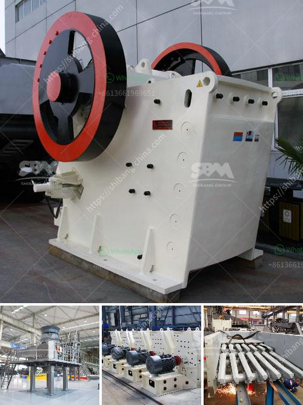

<h3>roller mill dimensions</h3>
Roller mills are a popular choice in the milling industry due to their ability to grind materials efficiently and effectively. They offer numerous advantages over traditional mills, including higher productivity, reduced energy consumption, and improved product quality. However, when it comes to roller mill dimensions, selecting the right size can significantly impact the mill's performance and overall efficiency. In this article, we will discuss the importance of roller mill dimensions and provide a comprehensive guide for choosing the appropriate size for your milling needs.

One of the crucial factors to consider when selecting a roller mill is the roller width. It determines the capacity of the mill and the amount of material the mill can process at a given time. A wider roller mill will have a larger grinding area, enabling it to handle more significant quantities of materials. Conversely, a narrow roller mill will have a smaller grinding area and may be suitable for smaller-scale operations.

Another critical dimension to consider is the roller diameter. It affects the speed at which the material is processed and the fineness of the grind. A larger roller diameter allows for faster processing and can produce a coarser grind, making it ideal for applications that require high throughput and a less refined final product. On the other hand, a smaller roller diameter will result in slower processing and a finer grind, making it suitable for applications that require a highly refined product.

The distance between the rollers, known as the roller gap, is another crucial dimension to consider. It directly influences the particle size distribution and provides control over the final product's fineness. A smaller roller gap will produce a finer grind, while a larger gap will produce a coarser grind. It is essential to choose a roller mill with an adjustable roller gap to accommodate various material types and desired grind sizes.

Additionally, the overall dimensions of the roller mill are important, especially if space is limited in your milling facility. It is vital to consider the height, width, and length of the mill to ensure it fits within your existing layout. A compact roller mill may be suitable for smaller spaces, while larger mills are ideal for larger facilities with ample working areas.

Furthermore, it is crucial to consider future expansion plans when selecting roller mill dimensions. If you anticipate an increase in production in the future, choosing a mill with the ability to be upgraded or added onto can save you significant costs down the line. It is wise to consult with mill manufacturers or experts who can provide insight into the scalability of different roller mills.

In conclusion, roller mill dimensions play a vital role in determining a mill's capacity, product quality, and overall efficiency. The roller width, diameter, gap, and overall dimensions should be carefully considered based on your specific milling needs, available space, and future expansion plans. By selecting the right size roller mill, you can optimize your milling operations, increase productivity, and achieve superior product quality.
<h3>Contact us</h3><ul><li><strong>Whatsapp:&nbsp;<a href="https://wa.me/8613661969651">+8613661969651</a></strong></li><li><a href="https://swt.shibang-china.com/?git&amp;zhl&amp;roller mill dimensions"><strong>Online Service(chat now)</strong></a></li></ul><h3>Related</h3><ul><li><a href='sand crusher price water.md'>sand crusher price water</a></li><li><a href='gypsum board processing machinery.md'>gypsum board processing machinery</a></li><li><a href='gyratory cone crusher.md'>gyratory cone crusher</a></li><li><a href='dolomite processing plan in ethiopia.md'>dolomite processing plan in ethiopia</a></li><li><a href='mobile crushers on tracks.md'>mobile crushers on tracks</a></li></ul>