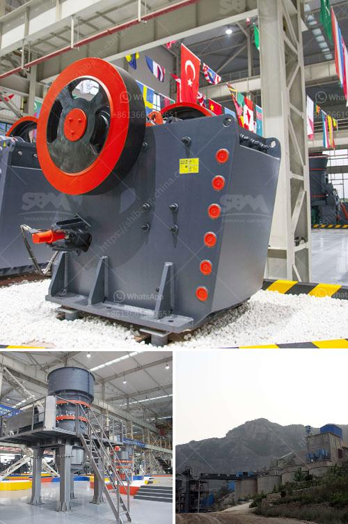

<h3>roller mill for dolmite</h3>
Dolomite, also known as calcium magnesium carbonate, is a non-metallic mineral with a wide range of applications. It is commonly used in building materials, ceramics, glass, refractory materials, chemicals, agriculture, environmental protection, energy conservation, and other fields. To meet the growing demand for dolomite, efficient processing equipment is required. The roller mill for dolomite is one such solution that offers high efficiency and ease of operation.

A roller mill is a grinding machine that is used to obtain the desired particle size distribution for dolomite powders. Many types of roller mills are available in the market, including those with three, four, and six rollers. These machines work by grinding the material between the rollers and the grinding table. The dolomite particles are crushed, ground, and classified by size during this process.

One of the key advantages of a roller mill is its ability to grind the dolomite to a fine powder with a narrow particle size distribution. This is crucial for applications such as ceramics and glass, where a uniform particle size is essential for achieving the desired properties. The roller mill can easily achieve a particle size range of 5-45 microns, ensuring the consistency and quality of the end product.

Another benefit of using a roller mill for dolomite is its energy efficiency. These machines are designed to minimize energy consumption while maintaining high grinding efficiency. The grinding process is carried out with minimum heat generation, ensuring that the dolomite properties are preserved. Additionally, roller mills have a lower carbon footprint compared to traditional grinding methods, contributing to a more sustainable production process.

In terms of operation, roller mills for dolomite are user-friendly and require minimal maintenance. They are equipped with automatic control systems that monitor and regulate the grinding parameters, ensuring consistent and optimal performance. The machines are also equipped with safety features to prevent accidents and protect the operators.

A roller mill for dolomite is a versatile solution that can be customized to suit specific requirements. It can be integrated into existing production lines or used as a standalone unit. The capacity of the roller mill can be adjusted according to the desired production output, making it suitable for small-scale operations as well as large industrial settings.

To conclude, a roller mill for dolomite is a reliable and efficient solution for grinding and processing this versatile mineral. The machine offers a wide range of particle sizes, energy efficiency, and ease of operation. With its customizable features, it can meet the specific requirements of various industries. Whether it is used in ceramics, glass, or agriculture, a roller mill for dolomite ensures high-quality products and contributes to a sustainable production process.
<h3>Contact us</h3><ul><li><strong>Whatsapp:&nbsp;<a href="https://wa.me/8613661969651">+8613661969651</a></strong></li><li><a href="https://swt.shibang-china.com/?git&amp;zhl&amp;roller mill for dolmite"><strong>Online Service(chat now)</strong></a></li></ul><h3>Related</h3><ul><li><a href='vrm and ball mill circulating load.md'>vrm and ball mill circulating load</a></li><li><a href='gypsum board processing machinery.md'>gypsum board processing machinery</a></li><li><a href='output of crushing plant.md'>output of crushing plant</a></li><li><a href='orifice of coal mill machine.md'>orifice of coal mill machine</a></li><li><a href='vertical shaft impact crusher plf.md'>vertical shaft impact crusher plf</a></li></ul>