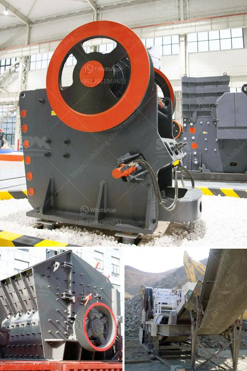

<h3>roller mill in india</h3>
The advent of roller mills in the Indian milling industry revolutionized the flour milling process. Traditional milling methods were time-consuming, labor-intensive, and often resulted in inconsistent flour quality. However, roller mills brought about a paradigm shift by introducing modern technology that significantly improved efficiency, productivity, and product consistency.

Roller mills are machines used to grind grains and other agricultural products into flour. They operate on a simple principle: a pair of cylindrical rollers rotate in opposite directions, crushing the grains between them. The resulting flour is then sifted and separated from any impurities, producing a finely ground product that is ready for consumption.

The introduction of roller mills in India has played a crucial role in enhancing the productivity of the milling industry. The efficiency of roller mills allows millers to process larger quantities of grains in a shorter period, ultimately increasing their output. This has had a positive impact on both the availability and affordability of flour in the market, benefiting both producers and consumers.

Furthermore, roller mills offer consistent and uniform grinding, ensuring that the flour produced is of superior quality. This is particularly important for industries such as bakeries and confectioneries that rely heavily on consistent flour texture and performance. With roller mills, millers can adjust the gap between the rollers, allowing them to control the fineness of the resulting flour. This level of precision ensures that the flour meets the desired specifications, catering to the specific requirements of different customers.

Roller mills also contribute to reduced energy consumption compared to traditional milling methods. The use of a streamlined process and modern technology translates into lower power requirements, making roller mills more eco-friendly and cost-effective in the long run. This aspect is highly significant given the current focus on sustainable practices and the need to reduce carbon footprints.

Moreover, roller mills have greatly simplified the milling process in India. The automation and mechanization features inherent in roller mills have minimized manual labor requirements, resulting in a more efficient working environment. This not only reduces physical strain on workers but also enhances overall safety standards. The simplicity and accessibility of roller mills have made them more user-friendly, allowing even smaller mills to adopt this technology.

While roller mills have brought immense benefits to the Indian milling industry, challenges persist. The high initial capital investment required to acquire roller mills can be a deterrent for small-scale and traditional millers. Moreover, maintenance and repair costs can also add to the overall expenses. However, the long-term benefits and returns offered by roller mills outweigh these initial concerns, thus encouraging their adoption.

In conclusion, roller mills have revolutionized the flour milling process in India. They have boosted productivity, improved flour quality, reduced energy consumption, simplified operations, and enhanced worker safety. Although challenges exist, the numerous advantages of roller mills make them a crucial tool for the Indian milling industry as it strives to meet the growing demand for flour efficiently and sustainably.
<h3>Contact us</h3><ul><li><strong>Whatsapp:&nbsp;<a href="https://wa.me/8613661969651">+8613661969651</a></strong></li><li><a href="https://swt.shibang-china.com/?git&amp;zhl&amp;roller mill in india"><strong>Online Service(chat now)</strong></a></li></ul><h3>Related</h3><ul><li><a href='concrete crusher prices.md'>concrete crusher prices</a></li><li><a href='ballast crusher prices in kenya.md'>ballast crusher prices in kenya</a></li><li><a href='crusher for granite.md'>crusher for granite</a></li><li><a href='copper ore concentration plant supplier.md'>copper ore concentration plant supplier</a></li><li><a href='stone crusher machines.md'>stone crusher machines</a></li></ul>