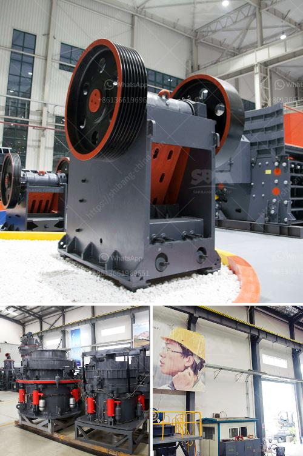

<h3>roller mill vs hammer mill</h3>
Grinding is one of the most important operations in the flour milling process. The milling machines used to achieve this goal are known as roller mills and hammer mills. These mills have different construction and grinding principles, and hence, provide different milling outputs. In this article, we will discuss the two main types of milling machines used in the flour milling industry, roller mills and hammer mills, and analyze their pros and cons.

Let's first understand the working principles of both machines. A roller mill works by grinding materials at high speed with rotating cylindrical rollers. Material is fed into the mill and trapped between the rollers and the grinding surface, which can be either a solid or a perforated screen. The grinding action of the rollers breaks the material into smaller particles, resulting in a fine flour-like product.

On the other hand, a hammer mill operates on a completely different principle. In a hammer mill, the material is fed into a chamber where a series of rotating hammers impact it to break it down into smaller pieces. These hammers are attached to a rotor that spins at high speed, thereby generating the necessary force to grind the material. The final product obtained from a hammer mill may be coarser than that obtained from a roller mill.

Now let's compare the advantages and disadvantages of these two milling machines. One of the primary advantages of roller mills is their ability to produce a uniform particle size distribution. This is crucial in the milling industry as it ensures consistent flour quality. Additionally, roller mills generally require less energy compared to hammer mills, making them more energy efficient. They are also relatively quiet and produce less dust during the milling process, which is advantageous from a safety and hygiene perspective.

On the other hand, hammer mills have their own set of advantages. One of the main advantages is their versatility. Hammer mills are capable of grinding a wide variety of materials, including grains, minerals, and industrial by-products. This makes them suitable for various industries beyond just flour milling. Additionally, hammer mills are usually more cost-effective than roller mills, as they require fewer maintenance and repair costs. They are also easier to operate and can be quickly set up for use.

In conclusion, roller mills and hammer mills are both effective milling machines used in the flour milling industry. While roller mills excel in achieving uniform particle size distributions and are more energy efficient, hammer mills are more versatile and cost-effective. It ultimately depends on the specific requirements of the milling process and the materials being processed. Therefore, flour millers should carefully consider their needs and select the appropriate milling machine for their operation.
<h3>Contact us</h3><ul><li><strong>Whatsapp:&nbsp;<a href="https://wa.me/8613661969651">+8613661969651</a></strong></li><li><a href="https://swt.shibang-china.com/?git&amp;zhl&amp;roller mill vs hammer mill"><strong>Online Service(chat now)</strong></a></li></ul><h3>Related</h3><ul><li><a href='sand washing plant in south africa.md'>sand washing plant in south africa</a></li><li><a href='proposal on quarry business.md'>proposal on quarry business</a></li><li><a href='cement packing process.md'>cement packing process</a></li><li><a href='cost to construct a cement factory.md'>cost to construct a cement factory</a></li><li><a href='used portable rock crusher for sale.md'>used portable rock crusher for sale</a></li></ul>